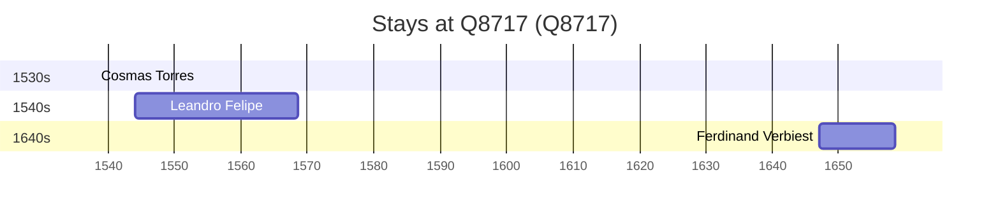

# Q8717

*(fetch error: HTTP Error 429: Too Many Requests)*

Wikidata: [Q8717](https://www.wikidata.org/wiki/Q8717)

5 occurrence(s) across 1 transcribed value(s), 3 person(s).

**Transcribed variants:**

- `Sevilha` (5×, 1538–1655)

| Date | Variant | Person | Type | Entity id | Real entity |
|------|---------|--------|------|-----------|-------------|
| — | Sevilha | Cosmas Torres | estadia | [deh-cosmas-torres](deh-cosmas-torres) | — |
| 1538 | Sevilha | Cosmas Torres | jesuita-ordenacao-padre | [deh-cosmas-torres](deh-cosmas-torres) | — |
| 1544 | Sevilha | Leandro Felipe | nascimento | [deh-leandro-felipe](deh-leandro-felipe) | — |
| 1647 | Sevilha | Ferdinand Verbiest | estadia | [deh-ferdinand-verbiest](deh-ferdinand-verbiest) | [rp339905](rp339905) |
| 1655 | Sevilha | Ferdinand Verbiest | estadia | [deh-ferdinand-verbiest](deh-ferdinand-verbiest) | [rp339905](rp339905) |

