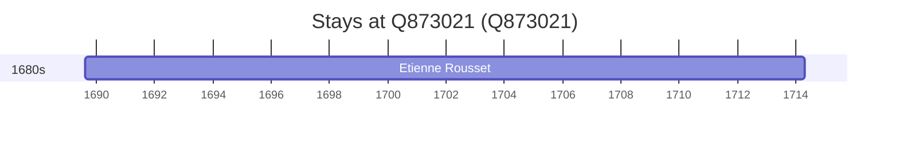

# Q873021

*(fetch error: HTTP Error 429: Too Many Requests)*

Wikidata: [Q873021](https://www.wikidata.org/wiki/Q873021)

1 occurrence(s) across 1 transcribed value(s), 1 person(s).

**Transcribed variants:**

- `Diocese de Nevers` (1×, 1689–1689)

| Date | Variant | Person | Type | Entity id | Real entity |
|------|---------|--------|------|-----------|-------------|
| 1689-08-13 | Diocese de Nevers | Etienne Rousset | nascimento | [deh-etienne-rousset](deh-etienne-rousset) | — |

