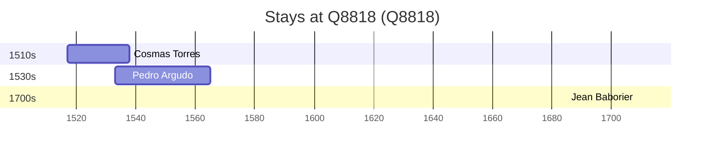

# Q8818

*(fetch error: HTTP Error 429: Too Many Requests)*

Wikidata: [Q8818](https://www.wikidata.org/wiki/Q8818)

3 occurrence(s) across 2 transcribed value(s), 3 person(s).

**Transcribed variants:**

- `Valença` (2×, 1517–1533)
- `Valencia` (1×, 1708–1708)

| Date | Variant | Person | Type | Entity id | Real entity |
|------|---------|--------|------|-----------|-------------|
| 1517 | Valença | Cosmas Torres | nascimento | [deh-cosmas-torres](deh-cosmas-torres) | — |
| 1533 | Valença | Pedro Argudo | nascimento | [deh-pedro-martins-ref3](deh-pedro-martins-ref3) | — |
| 1708-09-08 | Valencia | Jean Baborier | jesuita-ordenacao-padre | [deh-jean-baborier](deh-jean-baborier) | — |

### Co-presence

These persons were plausibly at this place during overlapping periods (interval estimation from stay dates; rough — see method note below).

| Period | Persons |
|--------|---------|
| 1530s | [Cosmas Torres](deh-cosmas-torres), [Pedro Argudo](deh-pedro-martins-ref3) |

*1 overlapping pair(s) involving 2 person(s). Method: interval start = stay event date; end = next embarque/partida/different-place event, or death, or +15yr cap.*

