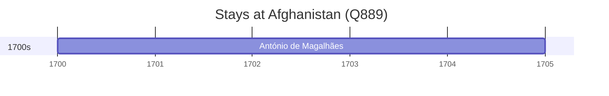

# Afghanistan (Q889)

*country in Central and South Asia*

Wikidata: [Q889](https://www.wikidata.org/wiki/Q889)

1 occurrence(s) across 1 transcribed value(s), 1 person(s).

**Transcribed variants:**

- `Afeganistão` (1×, 1700–1700)

| Date | Variant | Person | Type | Entity id | Real entity |
|------|---------|--------|------|-----------|-------------|
| 1700 | Afeganistão | António de Magalhães | estadia | [deh-antonio-de-magalhaes](deh-antonio-de-magalhaes) | — |

