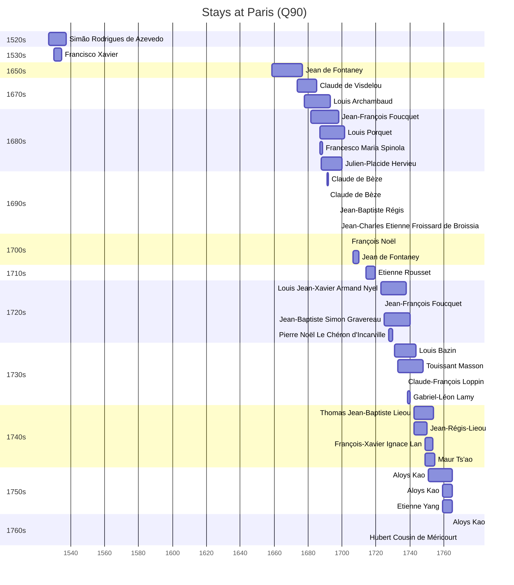

# Paris (Q90)

*capital and most populous city in France*

Wikidata: [Q90](https://www.wikidata.org/wiki/Q90)

53 occurrence(s) across 9 transcribed value(s), 33 person(s).

**Transcribed variants:**

- `Paris` (37×, 1527–1765)
- `Paris (capela do colégio)` (1×, 1691–1691)
- `Paris (Colégio de La Flèche)` (1×, 1697–1697)
- `Paris (casa professa)` (1×, 1697–1697)
- `Paris (colégio de La Flèche)` (6×, 1725–1762)
- `Paris (colégio Louis-le-Grand)` (4×, 1740–1742)
- `Paris («in E[cclesia] monialium Visit[ationis] B.M.V. in via dicta Dubacq»)` (1×, 1769–1769)
- `Paris (Seminário das missões estrangeiras)` (1×, 1786–1786)
- `Paris (província)` (1×, undated)

| Date | Variant | Person | Type | Entity id | Real entity |
|------|---------|--------|------|-----------|-------------|
| — | Paris (província) | Joseph-Olivier Lamy | residencia | [deh-gabriel-leon-lamy-ref2](deh-gabriel-leon-lamy-ref2) | [rp176128](rp176128) |
| — | Paris | Jean-Baptiste Simon Gravereau | estadia | [deh-jean-baptiste-simon-gravereau](deh-jean-baptiste-simon-gravereau) | — |
| — | Paris (colégio de La Flèche) | Louis-Daniel Le Comte | estadia | [deh-louis-daniel-le-comte](deh-louis-daniel-le-comte) | — |
| — | Paris | Louis-Marie Dugad | estadia | [deh-louis-marie-dugad](deh-louis-marie-dugad) | — |
| 1527 | Paris | Simão Rodrigues de Azevedo | estadia | [deh-simao-rodrigues-de-azevedo](deh-simao-rodrigues-de-azevedo) | — |
| 1530 | Paris | Francisco Xavier | estadia | [deh-francisco-xavier](deh-francisco-xavier) | — |
| 1534-08-15 | Paris | Simão Rodrigues de Azevedo | jesuita-fundador | [deh-simao-rodrigues-de-azevedo](deh-simao-rodrigues-de-azevedo) | — |
| 1536 | Paris | Simão Rodrigues de Azevedo | estadia | [deh-simao-rodrigues-de-azevedo](deh-simao-rodrigues-de-azevedo) | — |
| 1658-10-11 | Paris | Jean de Fontaney | jesuita-entrada | [deh-jean-de-fontaney](deh-jean-de-fontaney) | — |
| 1673-09-05 | Paris | Claude de Visdelou | jesuita-entrada | [deh-claude-de-visdelou](deh-claude-de-visdelou) | — |
| 1677-10-29 | Paris | Louis Archambaud | jesuita-entrada | [deh-louis-archambaud](deh-louis-archambaud) | — |
| 1681-09-17 | Paris | Jean-François Foucquet | jesuita-entrada | [deh-jean-francois-foucquet](deh-jean-francois-foucquet) | — |
| 1686-10-23 | Paris | Louis Porquet | jesuita-entrada | [deh-louis-porquet](deh-louis-porquet) | [rp585015](rp585015) |
| 1686-11-16 | Paris | Francesco Maria Spinola | estadia | [deh-francesco-maria-spinola](deh-francesco-maria-spinola) | [rp574322](rp574322) |
| 1687-09-07 | Paris | Julien-Placide Hervieu | jesuita-entrada | [deh-julien-placide-hervieu](deh-julien-placide-hervieu) | — |
| 1690-06-10 | Paris | Jean-Baptiste Simon Gravereau | nascimento | [deh-jean-baptiste-simon-gravereau](deh-jean-baptiste-simon-gravereau) | — |
| 1691 | Paris | Claude de Bèze | estadia | [deh-claude-de-beze](deh-claude-de-beze) | — |
| 1691-02-02 | Paris (capela do colégio) | Claude de Bèze | jesuita-votos-local | [deh-claude-de-beze](deh-claude-de-beze) | — |
| 1697-02-02 | Paris (casa professa) | Jean-Baptiste Régis | jesuita-votos-local | [deh-jean-baptiste-regis](deh-jean-baptiste-regis) | — |
| 1697-08-15 | Paris (Colégio de La Flèche) | Jean-Charles Etienne Froissard de Broissia | jesuita-votos-local | [deh-jean-charles-etienne-froissard-de-broissia](deh-jean-charles-etienne-froissard-de-broissia) | — |
| 1703-10-31 | Paris | François Noël | estadia | [deh-francois-noel](deh-francois-noel) | — |
| 1706-05-06 | Paris | Jean de Fontaney | estadia | [deh-jean-de-fontaney](deh-jean-de-fontaney) | — |
| 1714-04-25 | Paris | Etienne Rousset | jesuita-entrada | [deh-etienne-rousset](deh-etienne-rousset) | — |
| 1714-12-16 | Paris | Jean-Baptiste Simon Gravereau | jesuita-entrada | [deh-jean-baptiste-simon-gravereau](deh-jean-baptiste-simon-gravereau) | — |
| 1722-12-01 | Paris | Louis Jean-Xavier Armand Nyel | estadia | [deh-louis-jean-xavier-armand-nyel](deh-louis-jean-xavier-armand-nyel) | — |
| 1723-03-21 | Paris | Jean-François Foucquet | estadia | [deh-jean-francois-foucquet](deh-jean-francois-foucquet) | — |
| 1725 | Paris (colégio de La Flèche) | Jean-Baptiste Simon Gravereau | estadia | [deh-jean-baptiste-simon-gravereau](deh-jean-baptiste-simon-gravereau) | — |
| 1727-09-07 | Paris | Pierre Noël Le Chéron d'Incarville | jesuita-entrada | [deh-pierre-noel-le-cheron-dincarville](deh-pierre-noel-le-cheron-dincarville) | — |
| 1731-01-05 | Paris | Louis Bazin | jesuita-entrada | [deh-louis-bazin](deh-louis-bazin) | — |
| 1732-09-10 | Paris | Touissant Masson | jesuita-entrada | [deh-touissant-masson](deh-touissant-masson) | — |
| 1737 | Paris | Claude-François Loppin | jesuita-ordenacao-padre | [deh-claude-francois-loppin](deh-claude-francois-loppin) | — |
| 1738-10-05 | Paris | Gabriel-Léon Lamy | jesuita-entrada | [deh-gabriel-leon-lamy](deh-gabriel-leon-lamy) | — |
| 1740 | Paris (colégio Louis-le-Grand) | Maur Ts'ao | partida | [deh-maur-tsao](deh-maur-tsao) | — |
| 1742-06-09 | Paris (colégio Louis-le-Grand) | Thomas Jean-Baptiste Lieou | chegada | [deh-thomas-jean-baptiste-lieou](deh-thomas-jean-baptiste-lieou) | — |
| 1742-06-29 | Paris (colégio Louis-le-Grand) | Jean-Régis-Lieou | chegada | [deh-jean-regis-lieou](deh-jean-regis-lieou) | [rp660632](rp660632) |
| 1747-10-31 | Paris | Jean-Régis-Lieou | jesuita-entrada | [deh-jean-regis-lieou](deh-jean-regis-lieou) | [rp660632](rp660632) |
| 1748-10-29 | Paris | François-Xavier Ignace Lan | jesuita-entrada | [deh-francois-xavier-ignace-lan](deh-francois-xavier-ignace-lan) | — |
| 1748-10-29 | Paris | Maur Ts'ao | jesuita-entrada | [deh-maur-tsao](deh-maur-tsao) | — |
| 1748-10-29 | Paris | Thomas Jean-Baptiste Lieou | jesuita-entrada | [deh-thomas-jean-baptiste-lieou](deh-thomas-jean-baptiste-lieou) | — |
| 1751-01-07 | Paris | Aloys Kao | partida | [deh-aloys-kao](deh-aloys-kao) | — |
| 1751-07-07 | Paris (colégio de La Flèche) | Etienne Yang | partida | [deh-etienne-yang](deh-etienne-yang) | — |
| 1752-12-11 | Paris (colégio de La Flèche) | Jean Baborier | morte | [deh-jean-baborier](deh-jean-baborier) | — |
| 1759-03-10 | Paris | Aloys Kao | jesuita-entrada | [deh-aloys-kao](deh-aloys-kao) | — |
| 1759-03-10 | Paris | Etienne Yang | jesuita-entrada | [deh-etienne-yang](deh-etienne-yang) | — |
| 1762 | Paris (colégio de La Flèche) | Jean-Baptiste Simon Gravereau | estadia | [deh-jean-baptiste-simon-gravereau](deh-jean-baptiste-simon-gravereau) | — |
| 1763-05-28 | Paris | Aloys Kao | jesuita-ordenacao-padre | [deh-aloys-kao](deh-aloys-kao) | — |
| 1763-05-28 | Paris | Etienne Yang | jesuita-ordenacao-padre | [deh-etienne-yang](deh-etienne-yang) | — |
| 1763-05-28 | Paris | Aloys Kao | jesuita-ordenacao-padre | [deh-etienne-yang-ref1](deh-etienne-yang-ref1) | — |
| 1765-01 | Paris | Aloys Kao | estadia | [deh-aloys-kao](deh-aloys-kao) | — |
| 1769-08-15 | Paris («in E[cclesia] monialium Visit[ationis] B.M.V. in via dicta Dubacq») | Hubert Cousin de Méricourt | jesuita-votos-local | [deh-hubert-cousin-de-mericourt](deh-hubert-cousin-de-mericourt) | — |
| 1786-03-25 | Paris (Seminário das missões estrangeiras) | Louis-Marie Dugad | morte | [deh-louis-marie-dugad](deh-louis-marie-dugad) | — |
| >1751-01-07 | Paris (colégio de La Flèche) | Aloys Kao | estadia | [deh-aloys-kao](deh-aloys-kao) | — |
| >1751-01-07 | Paris (colégio Louis-le-Grand) | Aloys Kao | estadia | [deh-aloys-kao](deh-aloys-kao) | — |

### Co-presence

These persons were plausibly at this place during overlapping periods (interval estimation from stay dates; rough — see method note below).

| Period | Persons |
|--------|---------|
| 1530s | [Francisco Xavier](deh-francisco-xavier), [Simão Rodrigues de Azevedo](deh-simao-rodrigues-de-azevedo) |
| 1670s | [Claude de Visdelou](deh-claude-de-visdelou), [Jean de Fontaney](deh-jean-de-fontaney), [Louis Archambaud](deh-louis-archambaud) |
| 1680s | [Claude de Visdelou](deh-claude-de-visdelou), [Francesco Maria Spinola](rp574322), [Jean-François Foucquet](deh-jean-francois-foucquet), [Julien-Placide Hervieu](deh-julien-placide-hervieu), [Louis Archambaud](deh-louis-archambaud), [Louis Porquet](rp585015) |
| 1690s | [Claude de Bèze](deh-claude-de-beze), [Jean-Baptiste Régis](deh-jean-baptiste-regis), [Jean-Charles Etienne Froissard de Broissia](deh-jean-charles-etienne-froissard-de-broissia), [Jean-François Foucquet](deh-jean-francois-foucquet), [Julien-Placide Hervieu](deh-julien-placide-hervieu), [Louis Archambaud](deh-louis-archambaud), [Louis Porquet](rp585015) |
| 1720s | [Jean-François Foucquet](deh-jean-francois-foucquet), [Louis Jean-Xavier Armand Nyel](deh-louis-jean-xavier-armand-nyel), [Pierre Noël Le Chéron d'Incarville](deh-pierre-noel-le-cheron-dincarville) |
| 1730s | [Claude-François Loppin](deh-claude-francois-loppin), [Gabriel-Léon Lamy](deh-gabriel-leon-lamy), [Louis Bazin](deh-louis-bazin), [Louis Jean-Xavier Armand Nyel](deh-louis-jean-xavier-armand-nyel), [Touissant Masson](deh-touissant-masson) |
| 1740s | [François-Xavier Ignace Lan](deh-francois-xavier-ignace-lan), [Jean-Régis-Lieou](rp660632), [Louis Bazin](deh-louis-bazin), [Maur Ts'ao](deh-maur-tsao), [Thomas Jean-Baptiste Lieou](deh-thomas-jean-baptiste-lieou), [Touissant Masson](deh-touissant-masson) |
| 1750s | [Aloys Kao](deh-aloys-kao), [Etienne Yang](deh-etienne-yang), [François-Xavier Ignace Lan](deh-francois-xavier-ignace-lan), [Maur Ts'ao](deh-maur-tsao), [Thomas Jean-Baptiste Lieou](deh-thomas-jean-baptiste-lieou) |
| 1760s | [Aloys Kao](deh-aloys-kao), [Aloys Kao](deh-etienne-yang-ref1), [Etienne Yang](deh-etienne-yang) |

*56 overlapping pair(s) involving 25 person(s). Method: interval start = stay event date; end = next embarque/partida/different-place event, or death, or +15yr cap.*

