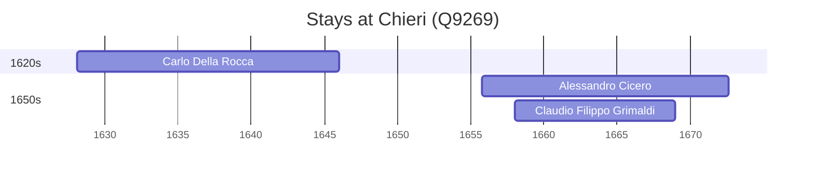

# Chieri (Q9269)

*Italian comune*

Wikidata: [Q9269](https://www.wikidata.org/wiki/Q9269)

3 occurrence(s) across 1 transcribed value(s), 3 person(s).

**Transcribed variants:**

- `Chieri` (3×, 1628–1658)

| Date | Variant | Person | Type | Entity id | Real entity |
|------|---------|--------|------|-----------|-------------|
| 1628-02-13 | Chieri | Carlo Della Rocca | jesuita-entrada | [deh-carlo-della-rocca](deh-carlo-della-rocca) | — |
| 1655-10-18 | Chieri | Alessandro Cicero | jesuita-entrada | [deh-alessandro-cicero](deh-alessandro-cicero) | [rp532453](rp532453) |
| 1658-01-13 | Chieri | Claudio Filippo Grimaldi | jesuita-entrada | [deh-claudio-filippo-grimaldi](deh-claudio-filippo-grimaldi) | — |

### Co-presence

These persons were plausibly at this place during overlapping periods (interval estimation from stay dates; rough — see method note below).

| Period | Persons |
|--------|---------|
| 1650s | [Alessandro Cicero](rp532453), [Claudio Filippo Grimaldi](deh-claudio-filippo-grimaldi) |

*1 overlapping pair(s) involving 2 person(s). Method: interval start = stay event date; end = next embarque/partida/different-place event, or death, or +15yr cap.*

