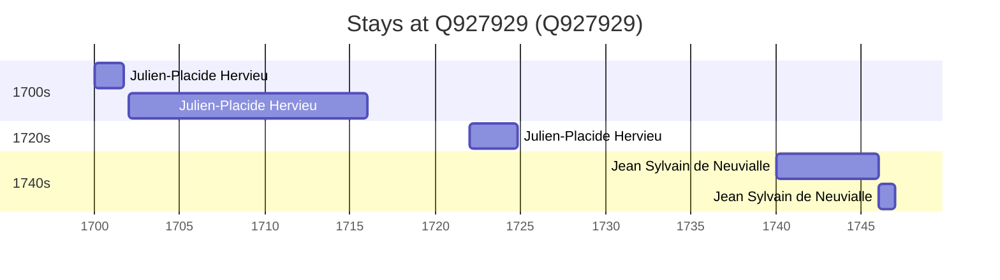

# Q927929

*(fetch error: HTTP Error 429: Too Many Requests)*

Wikidata: [Q927929](https://www.wikidata.org/wiki/Q927929)

6 occurrence(s) across 4 transcribed value(s), 2 person(s).

**Transcribed variants:**

- `Hwangchow (Houang-tcheou) Hukwang` (2×, 1700–1702)
- `Hoan tcheou, Hou-quan` (1×, 1706–1706)
- `Hwangchow, Hupeh` (1×, 1722–1722)
- `Hwangchow, Hou-pei` (2×, 1740–1746)

| Date | Variant | Person | Type | Entity id | Real entity |
|------|---------|--------|------|-----------|-------------|
| 1700 | Hwangchow (Houang-tcheou) Hukwang | Julien-Placide Hervieu | estadia | [deh-julien-placide-hervieu](deh-julien-placide-hervieu) | — |
| 1702 | Hwangchow (Houang-tcheou) Hukwang | Julien-Placide Hervieu | estadia | [deh-julien-placide-hervieu](deh-julien-placide-hervieu) | — |
| 1706-08-25 | Hoan tcheou, Hou-quan | Julien-Placide Hervieu | jesuita-votos-local | [deh-julien-placide-hervieu](deh-julien-placide-hervieu) | — |
| 1722 | Hwangchow, Hupeh | Julien-Placide Hervieu | estadia | [deh-julien-placide-hervieu](deh-julien-placide-hervieu) | — |
| 1740 | Hwangchow, Hou-pei | Jean Sylvain de Neuvialle | estadia | [deh-jean-sylvain-de-neuvialle](deh-jean-sylvain-de-neuvialle) | — |
| 1746 | Hwangchow, Hou-pei | Jean Sylvain de Neuvialle | estadia | [deh-jean-sylvain-de-neuvialle](deh-jean-sylvain-de-neuvialle) | — |

