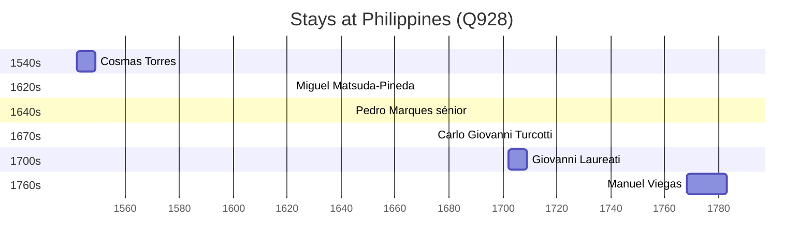

# Philippines (Q928)

*archipelagic country in Southeast Asia*

Wikidata: [Q928](https://www.wikidata.org/wiki/Q928)

10 occurrence(s) across 1 transcribed value(s), 10 person(s).

**Transcribed variants:**

- `Filipinas` (10×, 1542–1768)

| Date | Variant | Person | Type | Entity id | Real entity |
|------|---------|--------|------|-----------|-------------|
| — | Filipinas | Joseph Le Quesne | estadia | [deh-joseph-le-quesne](deh-joseph-le-quesne) | — |
| — | Filipinas | Martino Martini | estadia | [deh-martino-martini](deh-martino-martini) | — |
| — | Filipinas | Melchior Mora | estadia | [deh-melchior-mora](deh-melchior-mora) | — |
| — | Filipinas | Sebastião Vieira | estadia | [deh-sebastiao-vieira](deh-sebastiao-vieira) | — |
| 1542 | Filipinas | Cosmas Torres | estadia | [deh-cosmas-torres](deh-cosmas-torres) | — |
| 1621-05 | Filipinas | Miguel Matsuda-Pineda | jesuita-ordenacao-padre | [deh-miguel-matsuda-pineda](deh-miguel-matsuda-pineda) | — |
| 1643-06-08 | Filipinas | Pedro Marques, sénior | estadia | [deh-pedro-marques-senior](deh-pedro-marques-senior) | — |
| 1674 | Filipinas | Carlo Giovanni Turcotti | jesuita-ordenacao-padre | [deh-carlo-giovanni-turcotti](deh-carlo-giovanni-turcotti) | — |
| 1702 | Filipinas | Giovanni Laureati | estadia | [deh-giovanni-laureati](deh-giovanni-laureati) | [rp323905](rp323905) |
| 1768 | Filipinas | Manuel Viegas | estadia | [deh-manuel-viegas](deh-manuel-viegas) | — |

