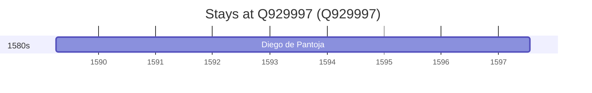

# Q929997

*(fetch error: HTTP Error 429: Too Many Requests)*

Wikidata: [Q929997](https://www.wikidata.org/wiki/Q929997)

1 occurrence(s) across 1 transcribed value(s), 1 person(s).

**Transcribed variants:**

- `Villaregio` (1×, 1589–1589)

| Date | Variant | Person | Type | Entity id | Real entity |
|------|---------|--------|------|-----------|-------------|
| 1589-04-06 | Villaregio | Diego de Pantoja | jesuita-entrada | [deh-diego-de-pantoja](deh-diego-de-pantoja) | — |

