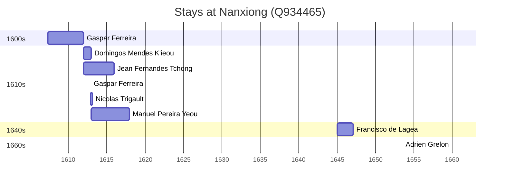

# Nanxiong (Q934465)

*subprefecture-level city in Guangdong, China*

Wikidata: [Q934465](https://www.wikidata.org/wiki/Q934465)

9 occurrence(s) across 6 transcribed value(s), 8 person(s).

**Transcribed variants:**

- `Namyung (Nan-hiong)` (4×, 1607–1612)
- `Nan-hiong (Namyung)` (1×, 1612–1612)
- `«Nanhiuni» (Namyung)` (1×, 1612–1612)
- `Namyong` (1×, 1613–1613)
- `Namyung (Nan-hiong), Kwangtung` (1×, 1645–1645)
- `Namyung (Nanhiong fou)` (1×, 1660–1660)

| Date | Variant | Person | Type | Entity id | Real entity |
|------|---------|--------|------|-----------|-------------|
| — | Namyung (Nan-hiong) | Pascoal Mendes K'ieou | chegada | [deh-pascoal-mendes-kieou](deh-pascoal-mendes-kieou) | — |
| 1607-04-27 | Namyung (Nan-hiong) | Gaspar Ferreira | estadia | [deh-gaspar-ferreira](deh-gaspar-ferreira) | — |
| 1612 | Namyung (Nan-hiong) | Jean Fernandes Tchong | estadia | [deh-jean-fernandes-tchong](deh-jean-fernandes-tchong) | — |
| 1612 | Namyung (Nan-hiong) | Domingos Mendes K'ieou | estadia | [deh-domingos-mendes-kieou](deh-domingos-mendes-kieou) | — |
| 1612-11-21 | «Nanhiuni» (Namyung) | Gaspar Ferreira | jesuita-votos-local | [deh-gaspar-ferreira](deh-gaspar-ferreira) | — |
| 1612-12 | Nan-hiong (Namyung) | Nicolas Trigault | estadia | [deh-nicolas-trigault](deh-nicolas-trigault) | — |
| 1613 | Namyong | Manuel Pereira Yeou | estadia | [deh-manuel-pereira-yeou](deh-manuel-pereira-yeou) | — |
| 1645 | Namyung (Nan-hiong), Kwangtung | Francisco de Lagea | estadia | [deh-francisco-de-lagea](deh-francisco-de-lagea) | — |
| 1660 | Namyung (Nanhiong fou) | Adrien Grelon | estadia | [deh-adrien-grelon](deh-adrien-grelon) | — |

### Co-presence

These persons were plausibly at this place during overlapping periods (interval estimation from stay dates; rough — see method note below).

| Period | Persons |
|--------|---------|
| 1610s | [Domingos Mendes K'ieou](deh-domingos-mendes-kieou), [Gaspar Ferreira](deh-gaspar-ferreira), [Jean Fernandes Tchong](deh-jean-fernandes-tchong), [Manuel Pereira Yeou](deh-manuel-pereira-yeou), [Nicolas Trigault](deh-nicolas-trigault) |

*7 overlapping pair(s) involving 5 person(s). Method: interval start = stay event date; end = next embarque/partida/different-place event, or death, or +15yr cap.*

