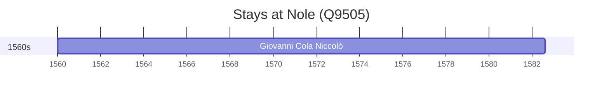

# Nole (Q9505)

*Italian comune*

Wikidata: [Q9505](https://www.wikidata.org/wiki/Q9505)

1 occurrence(s) across 1 transcribed value(s), 1 person(s).

**Transcribed variants:**

- `Nole, Itália` (1×, 1560–1560)

| Date | Variant | Person | Type | Entity id | Real entity |
|------|---------|--------|------|-----------|-------------|
| 1560 | Nole, Itália | Giovanni Cola Niccolò | nascimento | [deh-giovanni-cola-niccolo](deh-giovanni-cola-niccolo) | — |

