# Beijing (Q956)

*capital city of China*

Wikidata: [Q956](https://www.wikidata.org/wiki/Q956)

467 occurrence(s) across 6 transcribed value(s), 228 person(s).

**Transcribed variants:**

- `Pequim` (460×, 1598–1813)
- `Pequim (colégio)` (1×, 1690–1690)
- `Pequim (in E[cclesia] B.M.V. a Nativitate)` (1×, 1695–1695)
- `Pequim (igreja dos jesuítas franceses)` (1×, 1726–1726)
- `Pequim (prisão)` (1×, 1785–1785)
- `Pequim (corte)` (3×, undated)

| Date | Variant | Person | Type | Entity id | Real entity |
|------|---------|--------|------|-----------|-------------|
| — | Pequim | Bernard Rodes | estadia | [deh-bernard-rodes](deh-bernard-rodes) | — |
| — | Pequim | Bernhard Diestel | estadia | [deh-bernhard-diestel](deh-bernhard-diestel) | — |
| — | Pequim | Carlos de Resende | estadia | [deh-carlos-de-resende](deh-carlos-de-resende) | — |
| — | Pequim | Dominique Parrenin | estadia | [deh-dominique-parrenin](deh-dominique-parrenin) | — |
| — | Pequim | Ferdinando Bonaventura Moggi | estadia | [deh-ferdinando-bonaventura-moggi](deh-ferdinando-bonaventura-moggi) | — |
| — | Pequim | Ehrenbert Xaver Fridelli | estadia | [deh-ferdinando-bonaventura-moggi-ref1](deh-ferdinando-bonaventura-moggi-ref1) | — |
| — | Pequim | Francisco Simões | estadia | [deh-francisco-simoes](deh-francisco-simoes) | — |
| — | Pequim (corte) | Gabriel-Léon Lamy | estadia | [deh-gabriel-leon-lamy](deh-gabriel-leon-lamy) | — |
| — | Pequim | Gabriel-Léonard de Brossard | estadia | [deh-gabriel-leonard-de-brossard](deh-gabriel-leonard-de-brossard) | [rp176128](rp176128) |
| — | Pequim | Giacomo Filippo Simonelli | estadia | [deh-giacomo-filippo-simonelli](deh-giacomo-filippo-simonelli) | — |
| — | Pequim | Giovanni Francesco De Ferrariis | estadia | [deh-giovanni-francesco-de-ferrariis](deh-giovanni-francesco-de-ferrariis) | — |
| — | Pequim | Giovanni Laureati | estadia | [deh-giovanni-laureati](deh-giovanni-laureati) | [rp323905](rp323905) |
| — | Pequim | Giuseppe Baudino | estadia | [deh-giuseppe-baudino](deh-giuseppe-baudino) | — |
| — | Pequim | Ignace Hiu | estadia | [deh-ignace-hiu](deh-ignace-hiu) | — |
| — | Pequim | Jacques Brocard | estadia | [deh-jacques-brocard](deh-jacques-brocard) | [rp808798](rp808798) |
| — | Pequim | Jacques Motel | estadia | [deh-jacques-motel](deh-jacques-motel) | — |
| — | Pequim (corte) | Jean-Baptiste-Joseph de Grammont | estadia | [deh-jean-baptiste-joseph-de-grammont](deh-jean-baptiste-joseph-de-grammont) | — |
| — | Pequim | Jean-Baptiste Régis | estadia | [deh-jean-baptiste-regis](deh-jean-baptiste-regis) | — |
| — | Pequim (corte) | Jean-Charles Etienne Froissard de Broissia | estadia | [deh-jean-charles-etienne-froissard-de-broissia](deh-jean-charles-etienne-froissard-de-broissia) | — |
| — | Pequim | Jean Domenge | estadia | [deh-jean-domenge](deh-jean-domenge) | — |
| — | Pequim | Jean-Etienne Kao | estadia | [deh-jean-etienne-kao](deh-jean-etienne-kao) | — |
| — | Pequim | Jean-François Xavier Régis Tch'en | estadia | [deh-jean-francois-xavier-regis-tchen](deh-jean-francois-xavier-regis-tchen) | — |
| — | Pequim | Jean Yao | estadia | [deh-jean-yao](deh-jean-yao) | — |
| — | Pequim | Joachim Bouvet | estadia | [deh-joachim-bouvet](deh-joachim-bouvet) | [rp407623](rp407623) |
| — | Pequim | Joseph Le Quesne | partida | [deh-joseph-le-quesne](deh-joseph-le-quesne) | — |
| — | Pequim | Joseph Marie Anne de Moyriac Mailla | estadia | [deh-joseph-marie-anne-de-moyriac-mailla](deh-joseph-marie-anne-de-moyriac-mailla) | — |
| — | Pequim | Léon-Pascal Baron | estadia | [deh-leon-pascal-baron](deh-leon-pascal-baron) | — |
| — | Pequim | Louis de Pernon | estadia | [deh-louis-de-pernon](deh-louis-de-pernon) | — |
| — | Pequim | Manuel Jorge | jesuita-votos-local | [deh-manuel-jorge](deh-manuel-jorge) | — |
| — | Pequim | Jacques le Faure | estadia | [deh-manuel-jorge-ref2](deh-manuel-jorge-ref2) | — |
| — | Pequim | Manuel Rodrigues | estadia | [deh-manuel-rodrigues-ii](deh-manuel-rodrigues-ii) | — |
| — | Pequim | Martino Martini | estadia | [deh-martino-martini](deh-martino-martini) | — |
| — | Pequim | Michael Walta | estadia | [deh-michael-walta](deh-michael-walta) | — |
| — | Pequim | Michel Benoist | estadia | [deh-michel-benoist](deh-michel-benoist) | — |
| — | Pequim | Pierre Vincent de Tartre | estadia | [deh-pierre-vincent-de-tartre](deh-pierre-vincent-de-tartre) | — |
| 1598-09-07 | Pequim | Lazzaro Cattaneo | estadia | [deh-lazzaro-cattaneo](deh-lazzaro-cattaneo) | — |
| 1598-09-07 | Pequim | Sébastien Fernandes Tchong | estadia | [deh-sebastien-fernandes-tchong](deh-sebastien-fernandes-tchong) | — |
| 1598-09-07 | Pequim | Matteo Ricci | estadia | [deh-sebastien-fernandes-tchong-ref2](deh-sebastien-fernandes-tchong-ref2) | [rp302155](rp302155) |
| 1598-11-05 | Pequim | Lazzaro Cattaneo | estadia | [deh-lazzaro-cattaneo](deh-lazzaro-cattaneo) | — |
| 1598-11-05 | Pequim | Sébastien Fernandes Tchong | estadia | [deh-sebastien-fernandes-tchong](deh-sebastien-fernandes-tchong) | — |
| 1598-11-05 | Pequim | Matteo Ricci | estadia | [deh-sebastien-fernandes-tchong-ref2](deh-sebastien-fernandes-tchong-ref2) | [rp302155](rp302155) |
| 1600-05-19 | Pequim | Diego de Pantoja | partida | [deh-diego-de-pantoja](deh-diego-de-pantoja) | — |
| 1600-05-19 | Pequim | Matteo Ricci | partida | [deh-matteo-ricci](deh-matteo-ricci) | [rp302155](rp302155) |
| 1601-01-24 | Pequim | Diego de Pantoja | chegada | [deh-diego-de-pantoja](deh-diego-de-pantoja) | — |
| 1601-01-24 | Pequim | Matteo Ricci | chegada | [deh-matteo-ricci](deh-matteo-ricci) | [rp302155](rp302155) |
| 1602-07 | Pequim | Jacques Niva Ni | estadia | [deh-jacques-niva-ni](deh-jacques-niva-ni) | — |
| 1602-08-09 | Pequim | Manuel Dias, o Velho | chegada | [deh-manuel-dias-o-velho](deh-manuel-dias-o-velho) | — |
| 1602-09-20 | Pequim | Sébastien Fernandes Tchong | estadia | [deh-sebastien-fernandes-tchong](deh-sebastien-fernandes-tchong) | — |
| 1604 | Pequim | Sébastien Fernandes Tchong | estadia | [deh-sebastien-fernandes-tchong](deh-sebastien-fernandes-tchong) | — |
| 1604-02 | Pequim | Gaspar Ferreira | partida | [deh-gaspar-ferreira](deh-gaspar-ferreira) | — |
| 1604-08 | Pequim | Gaspar Ferreira | chegada | [deh-gaspar-ferreira](deh-gaspar-ferreira) | — |
| 1607 | Pequim | Sabatino De Ursis | chegada | [deh-sabatino-de-ursis](deh-sabatino-de-ursis) | — |
| 1607-10-29 | Pequim | Jean Fernandes Tchong | estadia | [deh-jean-fernandes-tchong](deh-jean-fernandes-tchong) | — |
| 1608 | Pequim | Sébastien Fernandes Tchong | estadia | [deh-sebastien-fernandes-tchong](deh-sebastien-fernandes-tchong) | — |
| 1609 | Pequim | Matteo Ricci | estadia | [deh-matteo-ricci](deh-matteo-ricci) | [rp302155](rp302155) |
| 1610 | Pequim | Manuel Pereira Yeou | estadia | [deh-manuel-pereira-yeou](deh-manuel-pereira-yeou) | — |
| 1610 | Pequim | Matteo Ricci | morte | [deh-manuel-pereira-yeou-ref1](deh-manuel-pereira-yeou-ref1) | [rp302155](rp302155) |
| 1610-05-11 | Pequim | Matteo Ricci | morte | [deh-matteo-ricci](deh-matteo-ricci) | [rp302155](rp302155) |
| 1611 | Pequim | Jacques Niva Ni | estadia | [deh-jacques-niva-ni](deh-jacques-niva-ni) | — |
| 1611-05-03 | Pequim | Feliciano da Silva | estadia | [deh-feliciano-da-silva](deh-feliciano-da-silva) | — |
| 1611-05-03 | Pequim | Niccolò Longobardo | estadia | [deh-niccolo-longobardo](deh-niccolo-longobardo) | — |
| 1611-12 | Pequim | Nicolas Trigault | estadia | [deh-nicolas-trigault](deh-nicolas-trigault) | — |
| 1613 | Pequim | Francesco Sambiasi | estadia | [deh-francesco-sambiasi](deh-francesco-sambiasi) | — |
| 1613 | Pequim | Domingos Mendes K'ieou | estadia | [deh-domingos-mendes-kieou](deh-domingos-mendes-kieou) | — |
| 1613 | Pequim | Giulio Aleni | estadia | [deh-giulio-aleni](deh-giulio-aleni) | — |
| 1613 | Pequim | Manuel Dias, o Novo | estadia | [deh-manuel-dias-o-novo](deh-manuel-dias-o-novo) | — |
| 1613-05 | Pequim | Jacques Niva Ni | estadia | [deh-jacques-niva-ni](deh-jacques-niva-ni) | — |
| 1616 | Pequim | Francesco Sambiasi | estadia | [deh-francesco-sambiasi](deh-francesco-sambiasi) | — |
| 1617-03-18 | Pequim | Sabatino De Ursis | estadia | [deh-sabatino-de-ursis](deh-sabatino-de-ursis) | — |
| 1617-03-18 | Pequim | Diego Pantoja | estadia | [deh-sabatino-de-ursis-ref2](deh-sabatino-de-ursis-ref2) | — |
| 1621 | Pequim | Manuel Dias, o Novo | estadia | [deh-manuel-dias-o-novo](deh-manuel-dias-o-novo) | — |
| 1621 | Pequim | Pascoal Mendes K'ieou | estadia | [deh-pascoal-mendes-kieou](deh-pascoal-mendes-kieou) | — |
| 1623-01-25 | Pequim | Johann Adam Schall von Bell | chegada | [deh-johann-adam-schall-von-bell](deh-johann-adam-schall-von-bell) | — |
| 1623-01-25 | Pequim | Niccolò Longobardo | chegada | [deh-johann-adam-schall-von-bell-ref4](deh-johann-adam-schall-von-bell-ref4) | — |
| 1628 | Pequim | André Palmeiro | estadia | [deh-andre-palmeiro](deh-andre-palmeiro) | [rp983183](rp983183) |
| 1628-12 | Pequim | João Rodrigues Tçuzu | estadia | [deh-joao-rodrigues-tcuzu](deh-joao-rodrigues-tcuzu) | — |
| 1628-12 | Pequim | André Palmeiro | estadia | [deh-joao-rodrigues-tcuzu-ref3](deh-joao-rodrigues-tcuzu-ref3) | — |
| 1629-12-27 | Pequim | Johann Terrenz Schreck | estadia | [deh-johann-terrenz-schreck](deh-johann-terrenz-schreck) | — |
| 1630 | Pequim | Johann Adam Schall von Bell | estadia | [deh-johann-adam-schall-von-bell](deh-johann-adam-schall-von-bell) | — |
| 1630-05-11 | Pequim | Giacomo Rho | partida | [deh-giacomo-rho](deh-giacomo-rho) | — |
| 1630-05-11 | Pequim | Johann Terrenz Schreck | morte | [deh-giacomo-rho-ref1](deh-giacomo-rho-ref1) | — |
| 1630-05-11 | Pequim | Johann Terrenz Schreck | morte | [deh-johann-terrenz-schreck](deh-johann-terrenz-schreck) | — |
| 1630-08 | Pequim | João Rodrigues Tçuzu | estadia | [deh-joao-rodrigues-tcuzu](deh-joao-rodrigues-tcuzu) | — |
| 1638-04-26 | Pequim | Giacomo Rho | morte | [deh-giacomo-rho](deh-giacomo-rho) | — |
| 1640-07-20 | Pequim | Christophe | morte | [deh-christophe](deh-christophe) | — |
| 1640-08-02 | Pequim | Chrysostome Fou Yuan | morte | [deh-chrysostome-fou-yuan](deh-chrysostome-fou-yuan) | — |
| 1640-08-26 | Pequim | Pascoal Mendes K'ieou | morte | [deh-pascoal-mendes-kieou](deh-pascoal-mendes-kieou) | — |
| 1641 | Pequim | Francisco Furtado | estadia | [deh-francisco-furtado](deh-francisco-furtado) | — |
| 1645 | Pequim | José de Almeida | estadia | [deh-jose-de-almeida-i](deh-jose-de-almeida-i) | — |
| 1648-02-22 | Pequim | Gabriel de Magalhães | estadia | [deh-gabriel-de-magalhaes](deh-gabriel-de-magalhaes) | [rp695666](rp695666) |
| 1648-02-22 | Pequim | Lodovico Buglio | estadia | [deh-lodovico-buglio](deh-lodovico-buglio) | — |
| 1648-02-22 | Pequim | Gabriel de Magalhães | estadia | [deh-lodovico-buglio-ref1](deh-lodovico-buglio-ref1) | — |
| 1649-03-27 | Pequim | Lodovico Buglio | jesuita-votos-local | [deh-lodovico-buglio](deh-lodovico-buglio) | — |
| 1649-05-09 | Pequim | Giovanni Francesco De Ferrariis | jesuita-votos-local | [deh-giovanni-francesco-de-ferrariis](deh-giovanni-francesco-de-ferrariis) | — |
| 1650 | Pequim | Francisco Furtado | estadia | [deh-francisco-furtado](deh-francisco-furtado) | — |
| 1651 | Pequim | Gabriel de Magalhães | estadia | [deh-gabriel-de-magalhaes](deh-gabriel-de-magalhaes) | [rp695666](rp695666) |
| 1651 | Pequim | Lodovico Buglio | estadia | [deh-lodovico-buglio](deh-lodovico-buglio) | — |
| 1651 | Pequim | Gabriel de Magalhães | estadia | [deh-lodovico-buglio-ref1](deh-lodovico-buglio-ref1) | — |
| 1655 | Pequim | Gabriel de Magalhães | estadia | [deh-gabriel-de-magalhaes](deh-gabriel-de-magalhaes) | [rp695666](rp695666) |
| 1655-06-28 | Pequim | Prospero Intorcetta | estadia | [deh-prospero-intorcetta](deh-prospero-intorcetta) | — |
| 1655-06-28 | Pequim | Pietro Canevari | estadia | [deh-prospero-intorcetta-ref1](deh-prospero-intorcetta-ref1) | — |
| 1655-12-11 | Pequim | Niccolò Longobardo | morte | [deh-niccolo-longobardo](deh-niccolo-longobardo) | — |
| 1659-04-22 | Pequim | Simão da Cunha | estadia | [deh-simao-da-cunha](deh-simao-da-cunha) | — |
| 1659-08-02 | Pequim | Johann Grueber | estadia | [deh-johann-grueber](deh-johann-grueber) | — |
| 1660-05-09 | Pequim | Ferdinand Verbiest | partida | [deh-ferdinand-verbiest](deh-ferdinand-verbiest) | [rp339905](rp339905) |
| 1660-06-09 | Pequim | Ferdinand Verbiest | chegada | [deh-ferdinand-verbiest](deh-ferdinand-verbiest) | [rp339905](rp339905) |
| 1660-06-09 | Pequim | Johann Adam Schall von Bell | estadia | [deh-ferdinand-verbiest-ref3](deh-ferdinand-verbiest-ref3) | — |
| 1664 | Pequim | Gabriel de Magalhães | estadia | [deh-gabriel-de-magalhaes](deh-gabriel-de-magalhaes) | [rp695666](rp695666) |
| 1665 | Pequim | Andrea-Giovanni Lubelli | estadia | [deh-andrea-giovanni-lubelli](deh-andrea-giovanni-lubelli) | — |
| 1665-09-12 | Pequim | Andrea-Giovanni Lubelli | partida | [deh-andrea-giovanni-lubelli](deh-andrea-giovanni-lubelli) | — |
| 1665-03-07 | Pequim | Michel Trigault | estadia | [deh-michel-trigault](deh-michel-trigault) | — |
| 1665-06-13 | Pequim | Adrien Grelon | estadia | [deh-adrien-grelon](deh-adrien-grelon) | — |
| 1665-06-28 | Pequim | Pietro Canevari | chegada | [deh-pietro-canevari](deh-pietro-canevari) | — |
| 1665-07 | Pequim | Claude Motel | estadia | [deh-claude-motel](deh-claude-motel) | — |
| 1665-07-18 | Pequim | Francesco Brancati | estadia | [deh-francesco-brancati](deh-francesco-brancati) | — |
| 1666-08-15 | Pequim | Johann Adam Schall von Bell | morte | [deh-johann-adam-schall-von-bell](deh-johann-adam-schall-von-bell) | — |
| 1670-01 | Pequim | Francisco Pimentel | partida | [deh-francisco-pimentel](deh-francisco-pimentel) | — |
| 1670-07-31 | Pequim | Francisco Pimentel | estadia | [deh-francisco-pimentel](deh-francisco-pimentel) | — |
| 1670-07-31 | Pequim | Manuel de Saldanha | estadia | [deh-francisco-pimentel-ref1](deh-francisco-pimentel-ref1) | — |
| 1671 | Pequim | Claudio Filippo Grimaldi | estadia | [deh-claudio-filippo-grimaldi](deh-claudio-filippo-grimaldi) | — |
| 1671 | Pequim | Manuel de Siqueira Tcheng | estadia | [deh-manuel-de-siqueira-tcheng](deh-manuel-de-siqueira-tcheng) | [rp166098](rp166098) |
| 1673-01 | Pequim | Tomé (Sancho) Pereira | estadia | [deh-tome-pereira](deh-tome-pereira) | — |
| 1673-05-26 | Pequim | Manuel de Siqueira Tcheng | morte | [deh-manuel-de-siqueira-tcheng](deh-manuel-de-siqueira-tcheng) | [rp166098](rp166098) |
| 1673-06 | Pequim | Christian Wolfgang Henriques Herdtrich | estadia | [deh-christian-wolfgang-henriques-herdtrich](deh-christian-wolfgang-henriques-herdtrich) | [rp669413](rp669413) |
| 1677 | Pequim | Gabriel de Magalhães | estadia | [deh-gabriel-de-magalhaes](deh-gabriel-de-magalhaes) | [rp695666](rp695666) |
| 1677-05-06 | Pequim | Gabriel de Magalhães | morte | [deh-gabriel-de-magalhaes](deh-gabriel-de-magalhaes) | [rp695666](rp695666) |
| 1678-01-13 | Pequim | Sebastião de Almeida | estadia | [deh-sebastiao-de-almeida](deh-sebastiao-de-almeida) | — |
| 1680-08-15 | Pequim | Tomé (Sancho) Pereira | jesuita-votos-local | [deh-tome-pereira](deh-tome-pereira) | — |
| 1680-08-15 | Pequim | Ferdinand Verbiest | estadia | [deh-tome-pereira-ref3](deh-tome-pereira-ref3) | [rp339905](rp339905) |
| 1681 | Pequim | Matthieu Lo | nascimento | [deh-matthieu-lo](deh-matthieu-lo) | — |
| 1682-10-07 | Pequim | Lodovico Buglio | morte | [deh-lodovico-buglio](deh-lodovico-buglio) | — |
| 1685-11-07 | Pequim | Claudio Filippo Grimaldi | estadia | [deh-claudio-filippo-grimaldi](deh-claudio-filippo-grimaldi) | — |
| 1686-11-07 | Pequim | Antoine Thomas | estadia | [deh-antoine-thomas](deh-antoine-thomas) | [rp486350](rp486350) |
| 1687 | Pequim | Ferdinand Verbiest | estadia | [deh-ferdinand-verbiest](deh-ferdinand-verbiest) | [rp339905](rp339905) |
| 1688 | Pequim | José Soares | estadia | [deh-jose-soares](deh-jose-soares) | — |
| 1688 | Pequim | Manuel Rodrigues | estadia | [deh-manuel-rodrigues-iii](deh-manuel-rodrigues-iii) | — |
| 1688-01-28 | Pequim | Ferdinand Verbiest | morte | [deh-ferdinand-verbiest](deh-ferdinand-verbiest) | [rp339905](rp339905) |
| 1688-02-07 | Pequim | Claude de Visdelou | estadia | [deh-claude-de-visdelou](deh-claude-de-visdelou) | — |
| 1688-02-07 | Pequim | Jean de Fontaney | chegada | [deh-jean-de-fontaney](deh-jean-de-fontaney) | — |
| 1688-02-07 | Pequim | Jean-François Gerbillon | estadia | [deh-jean-francois-gerbillon](deh-jean-francois-gerbillon) | — |
| 1688-02-07 | Pequim | Joachim Bouvet | estadia | [deh-joachim-bouvet](deh-joachim-bouvet) | [rp407623](rp407623) |
| 1688-02-07 | Pequim | Louis-Daniel Le Comte | estadia | [deh-louis-daniel-le-comte](deh-louis-daniel-le-comte) | — |
| 1689-10-18 | Pequim | Jean-François Gerbillon | chegada | [deh-jean-francois-gerbillon](deh-jean-francois-gerbillon) | — |
| 1689-10-18 | Pequim | Tomé (Sancho) Pereira | estadia | [deh-tome-pereira](deh-tome-pereira) | — |
| 1689-10-18 | Pequim | Antoine Thomas | estadia | [deh-tome-pereira-ref1](deh-tome-pereira-ref1) | [rp486350](rp486350) |
| 1690 | Pequim | Giandomenico Gabiani | estadia | [deh-giandomenico-gabiani](deh-giandomenico-gabiani) | [rp565060](rp565060) |
| 1690 | Pequim | Pinnacius | estadia | [deh-pinnacius](deh-pinnacius) | — |
| 1690-07-31 | Pequim | Jean-François Gerbillon | jesuita-votos-local | [deh-jean-francois-gerbillon](deh-jean-francois-gerbillon) | — |
| 1690-07-31 | Pequim | Giandomenico Gabiani | estadia | [deh-jean-francois-gerbillon-ref3](deh-jean-francois-gerbillon-ref3) | [rp565060](rp565060) |
| 1690-08-15 | Pequim (colégio) | José Soares | jesuita-votos-local | [deh-jose-soares](deh-jose-soares) | — |
| 1690-08-15 | Pequim | Guabiani | estadia | [deh-jose-soares-ref1](deh-jose-soares-ref1) | — |
| 1691 | Pequim | Giandomenico Gabiani | estadia | [deh-giandomenico-gabiani](deh-giandomenico-gabiani) | [rp565060](rp565060) |
| 1691-10-15 | Pequim | Alessandro Cicero | partida | [deh-alessandro-cicero](deh-alessandro-cicero) | [rp532453](rp532453) |
| 1692 | Pequim | Jean de Fontaney | estadia | [deh-jean-de-fontaney](deh-jean-de-fontaney) | — |
| 1692 | Pequim | Manuel Osório | estadia | [deh-manuel-osorio-i](deh-manuel-osorio-i) | — |
| 1692-02-02 | Pequim | Joachim Bouvet | jesuita-votos-local | [deh-joachim-bouvet](deh-joachim-bouvet) | [rp407623](rp407623) |
| 1692-03-12 | Pequim | Isidoro Lucci | partida | [deh-isidoro-lucci](deh-isidoro-lucci) | — |
| 1692-07-12 | Pequim | Isidoro Lucci | chegada | [deh-isidoro-lucci](deh-isidoro-lucci) | — |
| 1694 | Pequim | Giuseppe Baudino | partida | [deh-giuseppe-baudino](deh-giuseppe-baudino) | — |
| 1694 | Pequim | Manuel de Sá | partida | [deh-manuel-de-sa](deh-manuel-de-sa) | — |
| 1694-05-05 | Pequim | Francisco Simões | morte | [deh-francisco-simoes](deh-francisco-simoes) | — |
| 1694-08-28 | Pequim | Claudio Filippo Grimaldi | estadia | [deh-claudio-filippo-grimaldi](deh-claudio-filippo-grimaldi) | — |
| 1694-09 | Pequim | Adrien Grelon | estadia | [deh-adrien-grelon](deh-adrien-grelon) | — |
| 1694-10 | Pequim | Cristoforo Fiori | estadia | [deh-cristoforo-fiori](deh-cristoforo-fiori) | — |
| 1695 | Pequim | Kilian Stumpf | estadia | [deh-kilian-stumpf](deh-kilian-stumpf) | — |
| 1695-08-15 | Pequim (in E[cclesia] B.M.V. a Nativitate) | Manuel Osório | jesuita-votos-local | [deh-manuel-osorio-i](deh-manuel-osorio-i) | — |
| 1697-10 | Pequim | António de Barros | estadia | [deh-antonio-de-barros](deh-antonio-de-barros) | — |
| 1699 | Pequim | Jean de Fontaney | estadia | [deh-jean-de-fontaney](deh-jean-de-fontaney) | — |
| 1699 | Pequim | Charles de Belleville | estadia | [deh-charles-de-belleville](deh-charles-de-belleville) | [rp033271](rp033271) |
| 1700-08-07 | Pequim | Pierre Frapperie | chegada | [deh-pierre-frapperie](deh-pierre-frapperie) | — |
| 1701 | Pequim | Manuel Marques | estadia | [deh-manuel-marques](deh-manuel-marques) | — |
| 1701-07 | Pequim | António de Barros | estadia | [deh-antonio-de-barros](deh-antonio-de-barros) | — |
| 1701-07-31 | Pequim | Dominique Parrenin | jesuita-votos-local | [deh-dominique-parrenin](deh-dominique-parrenin) | — |
| 1701-12-03 | Pequim | António de Barros | jesuita-votos-local | [deh-antonio-de-barros](deh-antonio-de-barros) | — |
| 1702-11-03 | Pequim | Jean de Fontaney | estadia | [deh-jean-de-fontaney](deh-jean-de-fontaney) | — |
| 1702-11-04 | Pequim | Louis de Pernon | morte | [deh-louis-de-pernon](deh-louis-de-pernon) | — |
| 1703-02-02 | Pequim | Pierre Jartoux | jesuita-votos-local | [deh-pierre-jartoux](deh-pierre-jartoux) | — |
| 1703-11-20 | Pequim | Pierre Frapperie | morte | [deh-pierre-frapperie](deh-pierre-frapperie) | — |
| 1703-12-09 | Pequim | Jean-François Gerbillon | estadia | [deh-jean-francois-gerbillon](deh-jean-francois-gerbillon) | — |
| 1704-04-10 | Pequim | Giandomenico Paramino | partida | [deh-giandomenico-paramino](deh-giandomenico-paramino) | — |
| 1704-06 | Pequim | Giandomenico Paramino | chegada | [deh-giandomenico-paramino](deh-giandomenico-paramino) | — |
| 1704-12-08 | Pequim | Giandomenico Paramino | jesuita-votos-local | [deh-giandomenico-paramino](deh-giandomenico-paramino) | — |
| 1705-08 | Pequim | Antonio Francesco Giuseppe Provana | partida | [deh-antonio-francesco-giuseppe-provana](deh-antonio-francesco-giuseppe-provana) | [rp445313](rp445313) |
| 1705-08 | Pequim | Charles Thomas Maillard de Tournon | estadia | [deh-antonio-francesco-giuseppe-provana-ref1](deh-antonio-francesco-giuseppe-provana-ref1) | — |
| 1705-12-04 | Pequim | Charles Thomas Maillard de Tournon | estadia | [deh-antoine-thomas-ref4](deh-antoine-thomas-ref4) | — |
| 1706-05-20 | Pequim | Charles Thomas Maillard de Tournon | estadia | [deh-claudio-filippo-grimaldi-ref3](deh-claudio-filippo-grimaldi-ref3) | — |
| 1706-10-17 | Pequim | Antoine de Beauvollier | estadia | [deh-antoine-de-beauvollier](deh-antoine-de-beauvollier) | — |
| 1707 | Pequim | Ehrenbert Xaver Fridelli | estadia | [deh-ehrenbert-xaver-fridelli](deh-ehrenbert-xaver-fridelli) | — |
| 1707 | Pequim | Miguel Vieira | partida | [deh-miguel-vieira](deh-miguel-vieira) | — |
| 1707-03-25 | Pequim | Jean-François Gerbillon | morte | [deh-jean-francois-gerbillon](deh-jean-francois-gerbillon) | — |
| 1707-06-23 | Pequim | José Simões | estadia | [deh-jose-simoes](deh-jose-simoes) | — |
| 1707-10-27 | Pequim | Louis Fan | estadia | [deh-louis-fan](deh-louis-fan) | — |
| 1707-10-27 | Pequim | Antonio Francesco Giuseppe Provana | estadia | [deh-louis-fan-ref1](deh-louis-fan-ref1) | [rp445313](rp445313) |
| 1707-11-22 | Pequim | Franz Stadlin | estadia | [deh-franz-stadlin](deh-franz-stadlin) | — |
| 1707-11-22 | Pequim | Kaspar Castner | estadia | [deh-kaspar-castner](deh-kaspar-castner) | — |
| 1707-11-22 | Pequim | Leopold Liebstain | estadia | [deh-leopold-liebstain](deh-leopold-liebstain) | — |
| 1707-12-02 | Pequim | Luigi Gonzaga | partida | [deh-luigi-gonzaga](deh-luigi-gonzaga) | — |
| 1707-12-02 | Pequim | Romain Hinderer | partida | [deh-romain-hinderer](deh-romain-hinderer) | — |
| 1707-12-08 | Pequim | Ehrenbert Xaver Fridelli | jesuita-votos-local | [deh-ehrenbert-xaver-fridelli](deh-ehrenbert-xaver-fridelli) | — |
| 1708 | Pequim | Luigi Gonzaga | chegada | [deh-luigi-gonzaga](deh-luigi-gonzaga) | — |
| 1708 | Pequim | Romain Hinderer | chegada | [deh-romain-hinderer](deh-romain-hinderer) | — |
| 1708-12-08 | Pequim | Luigi Gonzaga | jesuita-votos-local | [deh-luigi-gonzaga](deh-luigi-gonzaga) | — |
| 1708-12-24 | Pequim | Tomé (Sancho) Pereira | morte | [deh-tome-pereira](deh-tome-pereira) | — |
| 1709-07-28 | Pequim | Antoine Thomas | morte | [deh-antoine-thomas](deh-antoine-thomas) | [rp486350](rp486350) |
| 1709-11-09 | Pequim | Kaspar Castner | morte | [deh-kaspar-castner](deh-kaspar-castner) | — |
| 1710 | Pequim | Ehrenbert Xaver Fridelli | estadia | [deh-ehrenbert-xaver-fridelli](deh-ehrenbert-xaver-fridelli) | — |
| 1710 | Pequim | Jean-François Foucquet | estadia | [deh-jean-francois-foucquet](deh-jean-francois-foucquet) | — |
| 1710 | Pequim | Pierre Jartoux | estadia | [deh-pierre-jartoux](deh-pierre-jartoux) | — |
| 1711 | Pequim | João Francisco Cardoso | estadia | [deh-joao-francisco-cardoso](deh-joao-francisco-cardoso) | — |
| 1711 | Pequim | Pierre Jartoux | estadia | [deh-pierre-jartoux](deh-pierre-jartoux) | — |
| 1711-01-05 | Pequim | Etienne Baptista P'eng | nascimento | [deh-etienne-baptista-peng](deh-etienne-baptista-peng) | — |
| 1711-04-26 | Pequim | Leopold Liebstain | morte | [deh-leopold-liebstain](deh-leopold-liebstain) | — |
| 1711-07 | Pequim | Franz Thilisch | chegada | [deh-franz-thilisch](deh-franz-thilisch) | — |
| 1712 | Pequim | João Mourão | estadia | [deh-joao-mourao](deh-joao-mourao) | — |
| 1712-11-08 | Pequim | Claudio Filippo Grimaldi | morte | [deh-claudio-filippo-grimaldi](deh-claudio-filippo-grimaldi) | — |
| 1714 | Pequim | Joseph Henry-Marie de Prémare | estadia | [deh-joseph-henry-marie-de-premare](deh-joseph-henry-marie-de-premare) | — |
| 1715-08 | Pequim | Giovanni Giuseppe Costa | estadia | [deh-giovanni-giuseppe-costa](deh-giovanni-giuseppe-costa) | — |
| 1715-12-22 | Pequim | Giuseppe Castiglione | chegada | [deh-giuseppe-castiglione](deh-giuseppe-castiglione) | — |
| 1716 | Pequim | António de Magalhães | estadia | [deh-antonio-de-magalhaes](deh-antonio-de-magalhaes) | — |
| 1716 | Pequim | Pierre Vincent de Tartre | estadia | [deh-pierre-vincent-de-tartre](deh-pierre-vincent-de-tartre) | — |
| 1716-02-25 | Pequim | João Francisco Cardoso | jesuita-votos-local | [deh-joao-francisco-cardoso](deh-joao-francisco-cardoso) | — |
| 1716-02-25 | Pequim | Kilian Stumpf | estadia | [deh-joao-francisco-cardoso-ref1](deh-joao-francisco-cardoso-ref1) | — |
| 1717 | Pequim | Jean-François Foucquet | estadia | [deh-jean-francois-foucquet](deh-jean-francois-foucquet) | — |
| 1717 | Pequim | Manuel Mendes | estadia | [deh-manuel-mendes](deh-manuel-mendes) | [rp352197](rp352197) |
| 1717-01-02 | Pequim | Ignatius Koegler | estadia | [deh-ignatius-koegler](deh-ignatius-koegler) | — |
| 1717-01-02 | Pequim | Karl Slaviček | chegada | [deh-karl-slavicek](deh-karl-slavicek) | — |
| 1717-01-02 | Pequim | Niccolò Gianpriamo | estadia | [deh-niccolo-gianpriamo](deh-niccolo-gianpriamo) | — |
| 1717-01-10 | Pequim | Jean-Baptiste Régis | chegada | [deh-jean-baptiste-regis](deh-jean-baptiste-regis) | — |
| 1718-02-12 | Pequim | Francisco Xavier Rosario Ho | estadia | [deh-francisco-xavier-rosario-ho](deh-francisco-xavier-rosario-ho) | [rp419976](rp419976) |
| 1718-10-07 | Pequim | Jacques Brocard | morte | [deh-jacques-brocard](deh-jacques-brocard) | [rp808798](rp808798) |
| 1718-12-24 | Pequim | Giuseppe Baudino | morte | [deh-giuseppe-baudino](deh-giuseppe-baudino) | — |
| 1719-08-15 | Pequim | Jean P'eng | nascimento | [deh-jean-peng](deh-jean-peng) | — |
| 1719-11 | Pequim | Etienne Rousset | estadia | [deh-etienne-rousset](deh-etienne-rousset) | — |
| 1719-11 | Pequim | Jean-Baptiste Simon Gravereau | estadia | [deh-jean-baptiste-simon-gravereau](deh-jean-baptiste-simon-gravereau) | — |
| 1719-11-01 | Pequim | Niccolò Gianpriamo | jesuita-votos-local | [deh-niccolo-gianpriamo](deh-niccolo-gianpriamo) | — |
| 1719-12-30 | Pequim | François-Xavier Dentrecolles | chegada | [deh-francois-xavier-dentrecolles](deh-francois-xavier-dentrecolles) | — |
| 1720 | Pequim | José Pereira | estadia | [deh-jose-pereira](deh-jose-pereira) | — |
| 1720 | Pequim | Mezzabarba | estadia | [deh-jose-pereira-ref1](deh-jose-pereira-ref1) | — |
| 1720-07-24 | Pequim | Kilian Stumpf | morte | [deh-kilian-stumpf](deh-kilian-stumpf) | — |
| 1720-10 | Pequim | François-Xavier Dentrecolles | chegada | [deh-francois-xavier-dentrecolles](deh-francois-xavier-dentrecolles) | — |
| 1720-10 | Pequim | Jean-François Foucquet | estadia | [deh-jean-francois-foucquet](deh-jean-francois-foucquet) | — |
| 1721-03-13 | Pequim | Niccolò Gianpriamo | estadia | [deh-niccolo-gianpriamo](deh-niccolo-gianpriamo) | — |
| 1721-07-24 | Pequim | Ehrenbert Xaver Fridelli | estadia | [deh-ehrenbert-xaver-fridelli](deh-ehrenbert-xaver-fridelli) | — |
| 1721-09-06 | Pequim | Francesco Folleri | partida | [deh-francesco-folleri](deh-francesco-folleri) | [rp233776](rp233776) |
| 1722 | Pequim | José Pereira | estadia | [deh-jose-pereira](deh-jose-pereira) | — |
| 1722 | Pequim | Mezzabarba | estadia | [deh-jose-pereira-ref1](deh-jose-pereira-ref1) | — |
| 1722-12-08 | Pequim | Giuseppe Castiglione | jesuita-votos-local | [deh-giuseppe-castiglione](deh-giuseppe-castiglione) | — |
| 1722-12-31 | Pequim | Jean-Baptiste Charles Jacques | partida | [deh-jean-baptiste-charles-jacques](deh-jean-baptiste-charles-jacques) | — |
| 1722-12-31 | Pequim | Antoine Gaubil | partida | [deh-jean-baptiste-charles-jacques-ref1](deh-jean-baptiste-charles-jacques-ref1) | — |
| 1723 | Pequim | François-Xavier Dentrecolles | chegada | [deh-francois-xavier-dentrecolles](deh-francois-xavier-dentrecolles) | — |
| 1723-03-10 | Pequim | João Mourão | estadia | [deh-joao-mourao](deh-joao-mourao) | — |
| 1723-04-09 | Pequim | Antoine Gaubil | chegada | [deh-antoine-gaubil](deh-antoine-gaubil) | — |
| 1723-04-09 | Pequim | Jean-Baptiste Charles Jacques | chegada | [deh-jean-baptiste-charles-jacques](deh-jean-baptiste-charles-jacques) | — |
| 1723-04-09 | Pequim | Antoine Gaubil | chegada | [deh-jean-baptiste-charles-jacques-ref1](deh-jean-baptiste-charles-jacques-ref1) | — |
| 1723-08-14 | Pequim | João Francisco Cardoso | morte | [deh-joao-francisco-cardoso](deh-joao-francisco-cardoso) | — |
| 1724 | Pequim | Karl Slaviček | estadia | [deh-karl-slavicek](deh-karl-slavicek) | — |
| 1724-02-25 | Pequim | Pierre Vincent de Tartre | morte | [deh-pierre-vincent-de-tartre](deh-pierre-vincent-de-tartre) | — |
| 1724-09-05 | Pequim | André Pereira | estadia | [deh-andre-pereira](deh-andre-pereira) | — |
| 1725 | Pequim | Carlos de Resende | estadia | [deh-carlos-de-resende](deh-carlos-de-resende) | — |
| 1725 | Pequim | Louis Fan | estadia | [deh-louis-fan](deh-louis-fan) | — |
| 1726 | Pequim | Policarpo de Sousa | estadia | [deh-policarpo-de-sousa](deh-policarpo-de-sousa) | [rp953824](rp953824) |
| 1726-08-26 | Pequim | Domingos Pinheiro | partida | [deh-domingos-pinheiro](deh-domingos-pinheiro) | — |
| 1726-08-26 | Pequim | Alexandre Metelo de Sousa e Meneses | partida | [deh-domingos-pinheiro-ref3](deh-domingos-pinheiro-ref3) | — |
| 1726-11-19 | Pequim | António de Magalhães | estadia | [deh-antonio-de-magalhaes](deh-antonio-de-magalhaes) | — |
| 1726-11-19 | Pequim | Alexandre Metelo de Sousa e Meneses | estadia | [deh-antonio-de-magalhaes-ref1](deh-antonio-de-magalhaes-ref1) | — |
| 1726-11-19 | Pequim | Paulo de Mesquita | estadia | [deh-paulo-de-mesquita](deh-paulo-de-mesquita) | — |
| 1726-11-24 | Pequim | Yong-Tcheng | estadia | [deh-antonio-de-magalhaes-ref2](deh-antonio-de-magalhaes-ref2) | — |
| 1726-12-15 | Pequim | Antoine Gaubil | jesuita-votos-local | [deh-antoine-gaubil](deh-antoine-gaubil) | — |
| 1726-12-15 | Pequim (igreja dos jesuítas franceses) | Etienne Rousset | jesuita-votos-local | [deh-etienne-rousset](deh-etienne-rousset) | — |
| 1726-12-15 | Pequim | François Xavier Dentrecolles | estadia | [deh-etienne-rousset-ref1](deh-etienne-rousset-ref1) | — |
| 1726-12-15 | Pequim | Jean-Baptiste Charles Jacques | jesuita-votos-local | [deh-jean-baptiste-charles-jacques](deh-jean-baptiste-charles-jacques) | — |
| 1726-12-30 | Pequim | Thomas Jean-Baptiste Lieou | nascimento | [deh-thomas-jean-baptiste-lieou](deh-thomas-jean-baptiste-lieou) | — |
| 1727 | Pequim | Caetano Lopes | estadia | [deh-caetano-lopes](deh-caetano-lopes) | — |
| 1727-02-02 | Pequim | Ferdinando Bonaventura Moggi | jesuita-votos-local | [deh-ferdinando-bonaventura-moggi](deh-ferdinando-bonaventura-moggi) | — |
| 1727-02-02 | Pequim | Paulo de Mesquita | jesuita-votos-local | [deh-paulo-de-mesquita](deh-paulo-de-mesquita) | — |
| 1728-11 | Pequim | Francesco Folleri | estadia | [deh-francesco-folleri](deh-francesco-folleri) | [rp233776](rp233776) |
| 1729-03 | Pequim | Alexandre de La Charme | estadia | [deh-alexandre-de-la-charme](deh-alexandre-de-la-charme) | — |
| 1729-03 | Pequim | Valentin Chalier | chegada | [deh-valentin-chalier](deh-valentin-chalier) | — |
| 1729-03 | Pequim | Alexandre La Charme | chegada | [deh-valentin-chalier-ref1](deh-valentin-chalier-ref1) | — |
| 1729-03-05 | Pequim | Paulo de Mesquita | morte | [deh-paulo-de-mesquita](deh-paulo-de-mesquita) | — |
| 1730 | Pequim | Francisco Xavier Rosario Ho | estadia | [deh-francisco-xavier-rosario-ho](deh-francisco-xavier-rosario-ho) | [rp419976](rp419976) |
| 1730 | Pequim | Jean-Etienne Kao | estadia | [deh-jean-etienne-kao](deh-jean-etienne-kao) | — |
| 1730-02-02 | Pequim | Louis Fan | jesuita-votos-local | [deh-louis-fan](deh-louis-fan) | — |
| 1730-06-28 | Pequim | Joachim Bouvet | morte | [deh-joachim-bouvet](deh-joachim-bouvet) | [rp407623](rp407623) |
| 1731-02-02 | Pequim | Alexandre de La Charme | jesuita-votos-local | [deh-alexandre-de-la-charme](deh-alexandre-de-la-charme) | — |
| 1731-03-08 | Pequim | Jean-Etienne Kao | jesuita-entrada | [deh-jean-etienne-kao](deh-jean-etienne-kao) | — |
| 1731-03-08 | Pequim | Matthieu Lo | jesuita-entrada | [deh-matthieu-lo](deh-matthieu-lo) | — |
| 1732-01-19 | Pequim | Aloys Kao | nascimento | [deh-aloys-kao](deh-aloys-kao) | — |
| 1732-01-19 | Pequim | Aloys Kao | nascimento | [deh-etienne-yang-ref1](deh-etienne-yang-ref1) | — |
| 1732-12-08 | Pequim | Policarpo de Sousa | jesuita-votos-local | [deh-policarpo-de-sousa](deh-policarpo-de-sousa) | [rp953824](rp953824) |
| 1733-02-08 | Pequim | Etienne Yang | nascimento | [deh-etienne-yang](deh-etienne-yang) | — |
| 1733-08-14 | Pequim | Pierre K'ieou | jesuita-entrada | [deh-pierre-kieou](deh-pierre-kieou) | — |
| 1733-10-31 | Pequim | Emmanuel de Silva Tchang | jesuita-entrada | [deh-emmanuel-de-silva-tchang](deh-emmanuel-de-silva-tchang) | [rp840713](rp840713) |
| 1733-10-31 | Pequim | Etienne Baptista P'eng | jesuita-entrada | [deh-etienne-baptista-peng](deh-etienne-baptista-peng) | — |
| 1733-10-31 | Pequim | Joseph Saraiva Chen | jesuita-entrada | [deh-joseph-saraiva-chen](deh-joseph-saraiva-chen) | — |
| 1733-12-08 | Pequim | Valentin Chalier | jesuita-votos-local | [deh-valentin-chalier](deh-valentin-chalier) | — |
| 1734-09-15 | Pequim | Gabriel Boussel | estadia | [deh-gabriel-boussel](deh-gabriel-boussel) | [rp796803](rp796803) |
| 1734-12-08 | Pequim | Gabriel Boussel | jesuita-votos-local | [deh-gabriel-boussel](deh-gabriel-boussel) | [rp796803](rp796803) |
| 1735-02-13 | Pequim | Jacques Cardoso | jesuita-entrada | [deh-jacques-cardoso](deh-jacques-cardoso) | — |
| 1735-02-28 | Pequim | Louis Fan | morte | [deh-louis-fan](deh-louis-fan) | — |
| 1735-03-24 | Pequim | António de Magalhães | morte | [deh-antonio-de-magalhaes](deh-antonio-de-magalhaes) | — |
| 1735-08-24 | Pequim | Karl Slaviček | morte | [deh-karl-slavicek](deh-karl-slavicek) | — |
| 1736 | Pequim | Josef Zallinger | morte | [deh-josef-zallinger](deh-josef-zallinger) | — |
| 1736-05-11 | Pequim | Francisco Xavier Rosario Ho | morte | [deh-francisco-xavier-rosario-ho](deh-francisco-xavier-rosario-ho) | [rp419976](rp419976) |
| 1736-09-14 | Pequim | José Soares | morte | [deh-jose-soares](deh-jose-soares) | — |
| 1738 | Pequim | Marcos Silveiro | estadia | [deh-marcos-silveiro](deh-marcos-silveiro) | — |
| 1738-01-12 | Pequim | Giacomo Antonini | partida | [deh-giacomo-antonini](deh-giacomo-antonini) | — |
| 1738-01-12 | Pequim | Félix da Rocha | partida | [deh-giacomo-antonini-ref1](deh-giacomo-antonini-ref1) | — |
| 1738-04-08 | Pequim | Giacomo Antonini | chegada | [deh-giacomo-antonini](deh-giacomo-antonini) | — |
| 1738-04-08 | Pequim | Félix da Rocha | chegada | [deh-giacomo-antonini-ref1](deh-giacomo-antonini-ref1) | — |
| 1738-07-13 | Pequim | Jean P'eng | jesuita-entrada | [deh-jean-peng](deh-jean-peng) | — |
| 1738-11-24 | Pequim | Jean-Baptiste Régis | morte | [deh-jean-baptiste-regis](deh-jean-baptiste-regis) | — |
| 1739 | Pequim | Gilles Thébault | estadia | [deh-gilles-thebault](deh-gilles-thebault) | — |
| 1739-03-01 | Pequim | Anton Gogeisl | estadia | [deh-anton-gogeisl](deh-anton-gogeisl) | — |
| 1739-03-01 | Pequim | August von Hallerstein | estadia | [deh-august-von-hallerstein](deh-august-von-hallerstein) | — |
| 1739-03-01 | Pequim | Florian Joseph Bahr | estadia | [deh-florian-joseph-bahr](deh-florian-joseph-bahr) | — |
| 1739-03-01 | Pequim | Joseph Saraiva Chen | chegada | [deh-joseph-saraiva-chen](deh-joseph-saraiva-chen) | — |
| 1739-11-07 | Pequim | Giacomo Antonini | jesuita-votos-local | [deh-giacomo-antonini](deh-giacomo-antonini) | — |
| 1739-11-15 | Pequim | Jean-Baptiste Laroche | jesuita-entrada | [deh-jean-baptiste-fichon-de-la-roche-ref8](deh-jean-baptiste-fichon-de-la-roche-ref8) | — |
| 1740 | Pequim | Antoine Gaubil | estadia | [deh-antoine-gaubil](deh-antoine-gaubil) | — |
| 1740 | Pequim | Franz Stadlin | estadia | [deh-franz-stadlin](deh-franz-stadlin) | — |
| 1740 | Pequim | Paul Kia | nascimento | [deh-paul-kia](deh-paul-kia) | — |
| 1740-04-14 | Pequim | Franz Stadlin | morte | [deh-franz-stadlin](deh-franz-stadlin) | — |
| 1741-02-02 | Pequim | Florian Joseph Bahr | jesuita-votos-local | [deh-florian-joseph-bahr](deh-florian-joseph-bahr) | — |
| 1741-07-02 | Pequim | François-Xavier Dentrecolles | morte | [deh-francois-xavier-dentrecolles](deh-francois-xavier-dentrecolles) | — |
| 1741-09-29 | Pequim | Dominique Parrenin | morte | [deh-dominique-parrenin](deh-dominique-parrenin) | — |
| 1741-12-08 | Pequim | Jean-Etienne Kao | jesuita-votos-local | [deh-jean-etienne-kao](deh-jean-etienne-kao) | — |
| 1741-12-08 | Pequim | Matthieu Lo | jesuita-votos-local | [deh-matthieu-lo](deh-matthieu-lo) | — |
| 1742 | Pequim | Johann Walter | partida | [deh-johann-walter](deh-johann-walter) | — |
| 1742 | Pequim | Joseph-Louis Desrobert | estadia | [deh-joseph-louis-desrobert](deh-joseph-louis-desrobert) | — |
| 1742-02-02 | Pequim | Pierre Noël Le Chéron d'Incarville | jesuita-votos-local | [deh-pierre-noel-le-cheron-dincarville](deh-pierre-noel-le-cheron-dincarville) | — |
| 1743 | Pequim | Emmanuel de Silva Tchang | estadia | [deh-emmanuel-de-silva-tchang](deh-emmanuel-de-silva-tchang) | [rp840713](rp840713) |
| 1743-06-04 | Pequim | Ehrenbert Xaver Fridelli | morte | [deh-ehrenbert-xaver-fridelli](deh-ehrenbert-xaver-fridelli) | — |
| 1743-12-02 | Pequim | André Pereira | morte | [deh-andre-pereira](deh-andre-pereira) | — |
| 1743-12-08 | Pequim | Gilles Thébault | jesuita-votos-local | [deh-gilles-thebault](deh-gilles-thebault) | — |
| 1744 | Pequim | António Gomes | estadia | [deh-antonio-gomes](deh-antonio-gomes) | — |
| 1744 | Pequim | Emmanuel de Silva Tchang | estadia | [deh-emmanuel-de-silva-tchang](deh-emmanuel-de-silva-tchang) | [rp840713](rp840713) |
| 1744 | Pequim | Etienne Baptista P'eng | morte | [deh-etienne-baptista-peng](deh-etienne-baptista-peng) | — |
| 1744 | Pequim | Jean-Baptiste Heou Yu | nascimento | [deh-jean-baptiste-heou-yu](deh-jean-baptiste-heou-yu) | — |
| 1744-02-02 | Pequim | Johann Walter | jesuita-votos-local | [deh-johann-walter](deh-johann-walter) | — |
| 1744-03-14 | Pequim | Paul Kia | morte | [deh-paul-kia](deh-paul-kia) | — |
| 1745 | Pequim | Ignaz Sichelbarth | chegada | [deh-ignaz-sichelbarth](deh-ignaz-sichelbarth) | — |
| 1745 | Pequim | Joseph Tcheou | jesuita-votos-local | [deh-joseph-tcheou](deh-joseph-tcheou) | — |
| 1746 | Pequim | Jean-Etienne Kao | estadia | [deh-jean-etienne-kao](deh-jean-etienne-kao) | — |
| 1746-02-02 | Pequim | Jean-Denis Attiret | jesuita-votos-local | [deh-jean-denis-attiret](deh-jean-denis-attiret) | — |
| 1746-02-05 | Pequim | Carlos de Resende | morte | [deh-carlos-de-resende](deh-carlos-de-resende) | — |
| 1746-03-30 | Pequim | Ignatius Koegler | morte | [deh-ignatius-koegler](deh-ignatius-koegler) | — |
| 1746-12-16 | Pequim | Matthieu Lo | morte | [deh-matthieu-lo](deh-matthieu-lo) | — |
| 1747-02-02 | Pequim | Félix da Rocha | jesuita-votos-local | [deh-felix-da-rocha](deh-felix-da-rocha) | — |
| 1747-02-28 | Pequim | Giovanni Giuseppe Costa | morte | [deh-giovanni-giuseppe-costa](deh-giovanni-giuseppe-costa) | — |
| 1747-04-12 | Pequim | Valentin Chalier | morte | [deh-valentin-chalier](deh-valentin-chalier) | — |
| 1748 | Pequim | João Simões | estadia | [deh-joao-simoes](deh-joao-simoes) | — |
| 1748-06-16 | Pequim | Domingos Pinheiro | morte | [deh-domingos-pinheiro](deh-domingos-pinheiro) | — |
| 1748-06-28 | Pequim | Joseph Marie Anne de Moyriac Mailla | morte | [deh-joseph-marie-anne-de-moyriac-mailla](deh-joseph-marie-anne-de-moyriac-mailla) | — |
| 1749-02-02 | Pequim | Gabriel-Léonard de Brossard | jesuita-votos-local | [deh-gabriel-leonard-de-brossard](deh-gabriel-leonard-de-brossard) | [rp176128](rp176128) |
| 1749-12 | Pequim | Gottfried Xaver von Laimbeckhoven | estadia | [deh-gottfried-xaver-von-laimbeckhoven](deh-gottfried-xaver-von-laimbeckhoven) | — |
| 1750-08-15 | Pequim | Michel Benoist | jesuita-votos-local | [deh-michel-benoist](deh-michel-benoist) | — |
| 1751 | Pequim | José Simões | estadia | [deh-jose-simoes](deh-jose-simoes) | — |
| 1751 | Pequim | Joseph de Aguiar Souen | estadia | [deh-joseph-de-aguiar-souen](deh-joseph-de-aguiar-souen) | — |
| 1751-01-07 | Pequim | Aloys Kao | estadia | [deh-aloys-kao](deh-aloys-kao) | — |
| 1751-02-02 | Pequim | Ignaz Sichelbarth | jesuita-votos-local | [deh-ignaz-sichelbarth](deh-ignaz-sichelbarth) | — |
| 1751-04-20 | Pequim | António Gomes | morte | [deh-antonio-gomes](deh-antonio-gomes) | — |
| 1751-08-15 | Pequim | João Simões | jesuita-votos-local | [deh-joao-simoes](deh-joao-simoes) | — |
| 1751-08-22 | Pequim | Jean-Joseph-Marie Amiot | estadia | [deh-jean-joseph-marie-amiot](deh-jean-joseph-marie-amiot) | — |
| 1751-08-22 | Pequim | José de Espinha | estadia | [deh-jose-de-espinha](deh-jose-de-espinha) | — |
| 1751-08-22 | Pequim | Manuel de Matos | chegada | [deh-manuel-de-matos](deh-manuel-de-matos) | — |
| 1751-11-23 | Pequim | Thomas Yang | morte | [deh-thomas-yang](deh-thomas-yang) | — |
| 1752-01-01 | Pequim | Joseph de Aguiar Souen | morte | [deh-joseph-de-aguiar-souen](deh-joseph-de-aguiar-souen) | — |
| 1753 | Pequim | Inácio Francisco | chegada | [deh-inacio-francisco](deh-inacio-francisco) | — |
| 1753 | Pequim | João de Seixas | estadia | [deh-joao-de-seixas](deh-joao-de-seixas) | — |
| 1753-05-01 | Pequim | Félix da Rocha | chegada | [deh-felix-da-rocha](deh-felix-da-rocha) | — |
| 1754 | Pequim | Paul Soeiro Ts'ouei | chegada | [deh-paul-soeiro-tsouei](deh-paul-soeiro-tsouei) | — |
| 1754-11-01 | Pequim | Jean-Joseph-Marie Amiot | jesuita-votos-local | [deh-jean-joseph-marie-amiot](deh-jean-joseph-marie-amiot) | — |
| 1755-10-29 | Pequim | Bartolomeu de Azevedo | morte | [deh-bartolomeu-de-azevedo](deh-bartolomeu-de-azevedo) | — |
| 1756-01-21 | Pequim | Gottfried Xaver von Laimbeckhoven | estadia | [deh-gottfried-xaver-von-laimbeckhoven](deh-gottfried-xaver-von-laimbeckhoven) | — |
| 1756-03-21 | Pequim | Félix da Rocha | estadia | [deh-felix-da-rocha](deh-felix-da-rocha) | — |
| 1757-05-12 | Pequim | Pierre Noël Le Chéron d'Incarville | morte | [deh-pierre-noel-le-cheron-dincarville](deh-pierre-noel-le-cheron-dincarville) | — |
| 1757-05-26 | Pequim | Policarpo de Sousa | morte | [deh-policarpo-de-sousa](deh-policarpo-de-sousa) | [rp953824](rp953824) |
| 1758-09-02 | Pequim | Etienne Rousset | morte | [deh-etienne-rousset](deh-etienne-rousset) | — |
| 1758-09-03 | Pequim | Gabriel-Léonard de Brossard | morte | [deh-gabriel-leonard-de-brossard](deh-gabriel-leonard-de-brossard) | [rp176128](rp176128) |
| 1759 | Pequim | Félix da Rocha | estadia | [deh-felix-da-rocha](deh-felix-da-rocha) | — |
| 1759 | Pequim | José Bernardo de Almeida | estadia | [deh-jose-bernardo-de-almeida](deh-jose-bernardo-de-almeida) | — |
| 1759-05-13 | Pequim | André Rodrigues | chegada | [deh-andre-rodrigues](deh-andre-rodrigues) | — |
| 1759-06-27 | Pequim | Johann Walter | morte | [deh-johann-walter](deh-johann-walter) | — |
| 1759-07-24 | Pequim | Antoine Gaubil | morte | [deh-antoine-gaubil](deh-antoine-gaubil) | — |
| 1760 | Pequim | Thomas Jean-Baptiste Lieou | estadia | [deh-thomas-jean-baptiste-lieou](deh-thomas-jean-baptiste-lieou) | — |
| 1760-02-02 | Pequim | Thomas Jean-Baptiste Lieou | jesuita-votos-local | [deh-thomas-jean-baptiste-lieou](deh-thomas-jean-baptiste-lieou) | — |
| 1760-04-21 | Pequim | Joseph-Louis Desrobert | morte | [deh-joseph-louis-desrobert](deh-joseph-louis-desrobert) | — |
| 1760-06-06 | Pequim | Jacques-François-Dieudonné d'Ollières | estadia | [deh-jacques-francois-dieudonne-dollieres](deh-jacques-francois-dieudonne-dollieres) | — |
| 1760-06-06 | Pequim | Pierre-Martial Cibot | estadia | [deh-pierre-martial-cibot](deh-pierre-martial-cibot) | [rp459497](rp459497) |
| 1761-08-27 | Pequim | Ferdinando Bonaventura Moggi | morte | [deh-ferdinando-bonaventura-moggi](deh-ferdinando-bonaventura-moggi) | — |
| 1762 | Pequim | François-Xavier Ignace Lan | estadia | [deh-francois-xavier-ignace-lan](deh-francois-xavier-ignace-lan) | — |
| 1762-04-29 | Pequim | Joseph Tcheou | morte | [deh-joseph-tcheou](deh-joseph-tcheou) | — |
| 1763 | Pequim | François Vincent Yang | estadia | [deh-francois-vincent-yang](deh-francois-vincent-yang) | — |
| 1763 | Pequim | Jean Yao | jesuita-entrada | [deh-jean-yao](deh-jean-yao) | — |
| 1764-11-22 | Pequim | Manuel de Matos | morte | [deh-manuel-de-matos](deh-manuel-de-matos) | — |
| 1766 | Pequim | Emmanuel de Silva Tchang | estadia | [deh-emmanuel-de-silva-tchang](deh-emmanuel-de-silva-tchang) | [rp840713](rp840713) |
| 1766 | Pequim | Louis Bazin | estadia | [deh-louis-bazin](deh-louis-bazin) | — |
| 1766-01-18 | Pequim | Gilles Thébault | morte | [deh-gilles-thebault](deh-gilles-thebault) | — |
| 1766-02-02 | Pequim | Etienne Yang | chegada | [deh-etienne-yang](deh-etienne-yang) | — |
| 1766-02-02 | Pequim | Aloys Kao | chegada | [deh-etienne-yang-ref1](deh-etienne-yang-ref1) | — |
| 1766-05-09 | Pequim | Aloys Kao | estadia | [deh-aloys-kao](deh-aloys-kao) | — |
| 1766-07-16 | Pequim | Giuseppe Castiglione | morte | [deh-giuseppe-castiglione](deh-giuseppe-castiglione) | — |
| 1766-07-24 | Pequim | Jean-Etienne Kao | morte | [deh-jean-etienne-kao](deh-jean-etienne-kao) | — |
| 1766-10-18 | Pequim | Jean-Matthieu Tournu Ventavon | partida | [deh-jean-matthieu-tournu-ventavon](deh-jean-matthieu-tournu-ventavon) | — |
| 1766-12-17 | Pequim | Joseph Saraiva Chen | morte | [deh-joseph-saraiva-chen](deh-joseph-saraiva-chen) | — |
| 1767-06-27 | Pequim | Alexandre de La Charme | morte | [deh-alexandre-de-la-charme](deh-alexandre-de-la-charme) | — |
| 1767-07-29 | Pequim | Ignace Hiu | morte | [deh-ignace-hiu](deh-ignace-hiu) | — |
| 1767-08-16 | Pequim | José de Espinha | estadia | [deh-onofrio-villiani-ref1](deh-onofrio-villiani-ref1) | — |
| 1768-07-01 | Pequim | François Bourgeois | estadia | [deh-francois-bourgeois](deh-francois-bourgeois) | — |
| 1768-12-08 | Pequim | Jean-Denis Attiret | morte | [deh-jean-denis-attiret](deh-jean-denis-attiret) | — |
| 1769 | Pequim | Pierre Vaquier La Baume | estadia | [deh-pierre-vaquier-la-baume](deh-pierre-vaquier-la-baume) | — |
| 1769-03-26 | Pequim | Jean-Paul Louis Collas | estadia | [deh-jean-paul-louis-collas](deh-jean-paul-louis-collas) | — |
| 1770-02-20 | Pequim | Pierre Vaquier La Baume | morte | [deh-pierre-vaquier-la-baume](deh-pierre-vaquier-la-baume) | — |
| 1770-09-08 | Pequim | Jean-Baptiste-Joseph de Grammont | jesuita-votos-local | [deh-jean-baptiste-joseph-de-grammont](deh-jean-baptiste-joseph-de-grammont) | — |
| 1770-09-08 | Pequim | Jean-Paul Louis Collas | jesuita-votos-local | [deh-jean-paul-louis-collas](deh-jean-paul-louis-collas) | — |
| 1771-06-07 | Pequim | Florian Joseph Bahr | morte | [deh-florian-joseph-bahr](deh-florian-joseph-bahr) | — |
| 1771-08-01 | Pequim | Jean-Matthieu Tournu Ventavon | estadia | [deh-jean-matthieu-tournu-ventavon](deh-jean-matthieu-tournu-ventavon) | — |
| 1771-09-29 | Pequim | Louis Antoine de Poirot | partida | [deh-louis-antoine-de-poirot](deh-louis-antoine-de-poirot) | — |
| 1771-10-12 | Pequim | Anton Gogeisl | morte | [deh-anton-gogeisl](deh-anton-gogeisl) | — |
| 1772 | Pequim | Jean-Régis-Lieou | estadia | [deh-jean-regis-lieou](deh-jean-regis-lieou) | [rp660632](rp660632) |
| 1773-01-12 | Pequim | Giuseppe Panzi | estadia | [deh-giuseppe-panzi](deh-giuseppe-panzi) | — |
| 1773-01-12 | Pequim | Hubert Cousin de Méricourt | chegada | [deh-hubert-cousin-de-mericourt](deh-hubert-cousin-de-mericourt) | — |
| 1773-01-25 | Pequim | Hubert Cousin de Méricourt | estadia | [deh-hubert-cousin-de-mericourt](deh-hubert-cousin-de-mericourt) | — |
| 1773-02-14 | Pequim | Jean-Baptiste Heou Yu | jesuita-entrada | [deh-jean-baptiste-heou-yu](deh-jean-baptiste-heou-yu) | — |
| 1773-02-14 | Pequim | Jean-Baptiste Heou Yu | morte | [deh-jean-baptiste-heou-yu](deh-jean-baptiste-heou-yu) | — |
| 1774-03-15 | Pequim | Louis Bazin | morte | [deh-louis-bazin](deh-louis-bazin) | — |
| 1774-08-20 | Pequim | Hubert Cousin de Méricourt | morte | [deh-hubert-cousin-de-mericourt](deh-hubert-cousin-de-mericourt) | — |
| 1774-10-23 | Pequim | Michel Benoist | morte | [deh-michel-benoist](deh-michel-benoist) | — |
| 1774-10-29 | Pequim | August von Hallerstein | morte | [deh-august-von-hallerstein](deh-august-von-hallerstein) | — |
| 1775 | Pequim | François-Xavier Ignace Lan | estadia | [deh-francois-xavier-ignace-lan](deh-francois-xavier-ignace-lan) | — |
| 1776-08-07 | Pequim | Jean-François Xavier Régis Tch'en | morte | [deh-jean-francois-xavier-regis-tchen](deh-jean-francois-xavier-regis-tchen) | — |
| 1778 | Pequim | Thomas Jean-Baptiste Lieou | estadia | [deh-thomas-jean-baptiste-lieou](deh-thomas-jean-baptiste-lieou) | — |
| 1780-08-08 | Pequim | Pierre-Martial Cibot | morte | [deh-pierre-martial-cibot](deh-pierre-martial-cibot) | [rp459497](rp459497) |
| 1780-10-06 | Pequim | Ignaz Sichelbarth | morte | [deh-ignaz-sichelbarth](deh-ignaz-sichelbarth) | — |
| 1780-12-09 | Pequim | Mateus de Sequeira | estadia | [deh-mateus-de-sequeira](deh-mateus-de-sequeira) | — |
| 1780-12-09 | Pequim | Almeida | estadia | [deh-mateus-de-sequeira-ref1](deh-mateus-de-sequeira-ref1) | — |
| 1780-12-24 | Pequim | Jacques-François-Dieudonné d'Ollières | morte | [deh-jacques-francois-dieudonne-dollieres](deh-jacques-francois-dieudonne-dollieres) | — |
| 1781-01-22 | Pequim | Jean-Paul Louis Collas | morte | [deh-jean-paul-louis-collas](deh-jean-paul-louis-collas) | — |
| 1781-05-18 | Pequim | Mateus de Sequeira | estadia | [deh-mateus-de-sequeira](deh-mateus-de-sequeira) | — |
| 1781-05-18 | Pequim | Almeida | estadia | [deh-mateus-de-sequeira-ref1](deh-mateus-de-sequeira-ref1) | — |
| 1781-05-22 | Pequim | Félix da Rocha | morte | [deh-felix-da-rocha](deh-felix-da-rocha) | — |
| 1781-06-25 | Pequim | Mateus de Sequeira | estadia | [deh-mateus-de-sequeira](deh-mateus-de-sequeira) | — |
| 1781-06-25 | Pequim | Almeida | estadia | [deh-mateus-de-sequeira-ref1](deh-mateus-de-sequeira-ref1) | — |
| 1785 | Pequim | Jean Simonelli Ngai | estadia | [deh-jean-simonelli-ngai](deh-jean-simonelli-ngai) | — |
| 1785-01-22 | Pequim | João de Seixas | morte | [deh-joao-de-seixas](deh-joao-de-seixas) | — |
| 1785-02-11 | Pequim (prisão) | Jean Simonelli Ngai | morte | [deh-jean-simonelli-ngai](deh-jean-simonelli-ngai) | — |
| 1787-05-27 | Pequim | Jean-Matthieu Tournu Ventavon | morte | [deh-jean-matthieu-tournu-ventavon](deh-jean-matthieu-tournu-ventavon) | — |
| 1788-07-10 | Pequim | José de Espinha | morte | [deh-jose-de-espinha](deh-jose-de-espinha) | — |
| 1789 | Pequim | Etienne Yang | estadia | [deh-etienne-yang](deh-etienne-yang) | — |
| 1791 | Pequim | Jean-Baptiste-Joseph de Grammont | estadia | [deh-jean-baptiste-joseph-de-grammont](deh-jean-baptiste-joseph-de-grammont) | — |
| 1791-04-21 | Pequim | Hyacinthe Paul Lieou, júnior | morte | [deh-hyacinthe-paul-lieou-junior](deh-hyacinthe-paul-lieou-junior) | — |
| 1792-07-29 | Pequim | François Bourgeois | morte | [deh-francois-bourgeois](deh-francois-bourgeois) | — |
| 1792-12-09 | Pequim | Inácio Francisco | morte | [deh-inacio-francisco](deh-inacio-francisco) | — |
| 1793-10-08 | Pequim | Jean-Joseph-Marie Amiot | morte | [deh-jean-joseph-marie-amiot](deh-jean-joseph-marie-amiot) | — |
| 1794-08-01 | Pequim | Jean-Régis-Lieou | morte | [deh-jean-regis-lieou](deh-jean-regis-lieou) | [rp660632](rp660632) |
| 1795 | Pequim | Aloys Kao | morte | [deh-aloys-kao](deh-aloys-kao) | — |
| 1795-12-04 | Pequim | Paul Soeiro Ts'ouei | morte | [deh-paul-soeiro-tsouei](deh-paul-soeiro-tsouei) | — |
| 1796-06-14 | Pequim | Thomas Jean-Baptiste Lieou | morte | [deh-thomas-jean-baptiste-lieou](deh-thomas-jean-baptiste-lieou) | — |
| 1796-07-30 | Pequim | François-Xavier Ignace Lan | morte | [deh-francois-xavier-ignace-lan](deh-francois-xavier-ignace-lan) | — |
| 1796-12-02 | Pequim | André Rodrigues | morte | [deh-andre-rodrigues](deh-andre-rodrigues) | — |
| 1805-11-12 | Pequim | José Bernardo de Almeida | morte | [deh-jose-bernardo-de-almeida](deh-jose-bernardo-de-almeida) | — |
| 1812 | Pequim | Jean-Baptiste-Joseph de Grammont | morte | [deh-jean-baptiste-joseph-de-grammont](deh-jean-baptiste-joseph-de-grammont) | — |
| 1812 | Pequim | Giuseppe Panzi | morte | [deh-giuseppe-panzi](deh-giuseppe-panzi) | — |
| 1813-12-13 | Pequim | Louis Antoine de Poirot | morte | [deh-louis-antoine-de-poirot](deh-louis-antoine-de-poirot) | — |
| >1694-07-11 | Pequim | Antonio Faglia | estadia | [deh-antonio-faglia](deh-antonio-faglia) | — |
| >1741-01-15 | Pequim | Pierre Noël Le Chéron d'Incarville | estadia | [deh-pierre-noel-le-cheron-dincarville](deh-pierre-noel-le-cheron-dincarville) | — |

### Co-presence

These persons were plausibly at this place during overlapping periods (interval estimation from stay dates; rough — see method note below).

| Period | Persons |
|--------|---------|
| 1590s | [Lazzaro Cattaneo](deh-lazzaro-cattaneo), [Sébastien Fernandes Tchong](deh-sebastien-fernandes-tchong) |
| 1600s | [Diego de Pantoja](deh-diego-de-pantoja), [Gaspar Ferreira](deh-gaspar-ferreira), [Jacques Niva Ni](deh-jacques-niva-ni), [Jean Fernandes Tchong](deh-jean-fernandes-tchong), [Manuel Dias, o Velho](deh-manuel-dias-o-velho), [Sabatino De Ursis](deh-sabatino-de-ursis), [Sébastien Fernandes Tchong](deh-sebastien-fernandes-tchong) |
| 1610s | [Diego de Pantoja](deh-diego-de-pantoja), [Domingos Mendes K'ieou](deh-domingos-mendes-kieou), [Feliciano da Silva](deh-feliciano-da-silva), [Francesco Sambiasi](deh-francesco-sambiasi), [Giulio Aleni](deh-giulio-aleni), [Jacques Niva Ni](deh-jacques-niva-ni), [Manuel Dias, o Novo](deh-manuel-dias-o-novo), [Manuel Pereira Yeou](deh-manuel-pereira-yeou), [Niccolò Longobardo](deh-niccolo-longobardo), [Nicolas Trigault](deh-nicolas-trigault), [Sabatino De Ursis](deh-sabatino-de-ursis) |
| 1620s | [André Palmeiro](rp983183), [Francesco Sambiasi](deh-francesco-sambiasi), [Johann Adam Schall von Bell](deh-johann-adam-schall-von-bell), [Johann Terrenz Schreck](deh-johann-terrenz-schreck), [João Rodrigues Tçuzu](deh-joao-rodrigues-tcuzu), [Manuel Dias, o Novo](deh-manuel-dias-o-novo), [Pascoal Mendes K'ieou](deh-pascoal-mendes-kieou) |
| 1630s | [André Palmeiro](rp983183), [Johann Adam Schall von Bell](deh-johann-adam-schall-von-bell), [Johann Terrenz Schreck](deh-johann-terrenz-schreck), [João Rodrigues Tçuzu](deh-joao-rodrigues-tcuzu), [Pascoal Mendes K'ieou](deh-pascoal-mendes-kieou) |
| 1640s | [Francisco Furtado](deh-francisco-furtado), [Gabriel de Magalhães](rp695666), [Gabriel de Magalhães](deh-lodovico-buglio-ref1), [Giovanni Francesco De Ferrariis](deh-giovanni-francesco-de-ferrariis), [Johann Adam Schall von Bell](deh-johann-adam-schall-von-bell), [José de Almeida](deh-jose-de-almeida-i), [Lodovico Buglio](deh-lodovico-buglio) |
| 1650s | [Francisco Furtado](deh-francisco-furtado), [Gabriel de Magalhães](rp695666), [Gabriel de Magalhães](deh-lodovico-buglio-ref1), [Johann Adam Schall von Bell](deh-johann-adam-schall-von-bell), [Johann Grueber](deh-johann-grueber), [Lodovico Buglio](deh-lodovico-buglio), [Prospero Intorcetta](deh-prospero-intorcetta), [Simão da Cunha](deh-simao-da-cunha) |
| 1660s | [Adrien Grelon](deh-adrien-grelon), [Andrea-Giovanni Lubelli](deh-andrea-giovanni-lubelli), [Claude Motel](deh-claude-motel), [Ferdinand Verbiest](rp339905), [Francesco Brancati](deh-francesco-brancati), [Gabriel de Magalhães](rp695666), [Johann Adam Schall von Bell](deh-johann-adam-schall-von-bell), [Johann Grueber](deh-johann-grueber), [Michel Trigault](deh-michel-trigault), [Pietro Canevari](deh-pietro-canevari), [Simão da Cunha](deh-simao-da-cunha) |
| 1670s | [Adrien Grelon](deh-adrien-grelon), [Christian Wolfgang Henriques Herdtrich](rp669413), [Claude Motel](deh-claude-motel), [Claudio Filippo Grimaldi](deh-claudio-filippo-grimaldi), [Ferdinand Verbiest](rp339905), [Francesco Brancati](deh-francesco-brancati), [Francisco Pimentel](deh-francisco-pimentel), [Gabriel de Magalhães](rp695666), [Pietro Canevari](deh-pietro-canevari), [Sebastião de Almeida](deh-sebastiao-de-almeida), [Tomé (Sancho) Pereira](deh-tome-pereira) |
| 1680s | [Antoine Thomas](rp486350), [Claude de Visdelou](deh-claude-de-visdelou), [Claudio Filippo Grimaldi](deh-claudio-filippo-grimaldi), [Ferdinand Verbiest](rp339905), [Jean de Fontaney](deh-jean-de-fontaney), [Jean-François Gerbillon](deh-jean-francois-gerbillon), [Joachim Bouvet](rp407623), [José Soares](deh-jose-soares), [Louis-Daniel Le Comte](deh-louis-daniel-le-comte), [Manuel Rodrigues](deh-manuel-rodrigues-iii), [Matthieu Lo](deh-matthieu-lo), [Sebastião de Almeida](deh-sebastiao-de-almeida), [Tomé (Sancho) Pereira](deh-tome-pereira) |
| 1690s | [Antoine Thomas](rp486350), [Antonio Faglia](deh-antonio-faglia), [António de Barros](deh-antonio-de-barros), [Charles de Belleville](rp033271), [Claudio Filippo Grimaldi](deh-claudio-filippo-grimaldi), [Cristoforo Fiori](deh-cristoforo-fiori), [Giandomenico Gabiani](rp565060), [Isidoro Lucci](deh-isidoro-lucci), [Jean de Fontaney](deh-jean-de-fontaney), [Jean-François Gerbillon](deh-jean-francois-gerbillon), [Joachim Bouvet](rp407623), [José Soares](deh-jose-soares), [Kilian Stumpf](deh-kilian-stumpf), [Manuel Osório](deh-manuel-osorio-i), [Manuel Rodrigues](deh-manuel-rodrigues-iii), [Matthieu Lo](deh-matthieu-lo), [Tomé (Sancho) Pereira](deh-tome-pereira) |
| 1700s | [Antoine de Beauvollier](deh-antoine-de-beauvollier), [António de Barros](deh-antonio-de-barros), [Charles de Belleville](rp033271), [Claudio Filippo Grimaldi](deh-claudio-filippo-grimaldi), [Dominique Parrenin](deh-dominique-parrenin), [Ehrenbert Xaver Fridelli](deh-ehrenbert-xaver-fridelli), [Franz Stadlin](deh-franz-stadlin), [Giandomenico Paramino](deh-giandomenico-paramino), [Jean de Fontaney](deh-jean-de-fontaney), [Jean-François Gerbillon](deh-jean-francois-gerbillon), [José Simões](deh-jose-simoes), [José Soares](deh-jose-soares), [Kaspar Castner](deh-kaspar-castner), [Kilian Stumpf](deh-kilian-stumpf), [Leopold Liebstain](deh-leopold-liebstain), [Louis Fan](deh-louis-fan), [Luigi Gonzaga](deh-luigi-gonzaga), [Manuel Osório](deh-manuel-osorio-i), [Matthieu Lo](deh-matthieu-lo), [Pierre Frapperie](deh-pierre-frapperie), [Pierre Jartoux](deh-pierre-jartoux), [Romain Hinderer](deh-romain-hinderer), [Tomé (Sancho) Pereira](deh-tome-pereira) |
| 1710s | [António de Magalhães](deh-antonio-de-magalhaes), [Claudio Filippo Grimaldi](deh-claudio-filippo-grimaldi), [Ehrenbert Xaver Fridelli](deh-ehrenbert-xaver-fridelli), [Etienne Baptista P'eng](deh-etienne-baptista-peng), [Etienne Rousset](deh-etienne-rousset), [Francisco Xavier Rosario Ho](rp419976), [Franz Stadlin](deh-franz-stadlin), [Franz Thilisch](deh-franz-thilisch), [François-Xavier Dentrecolles](deh-francois-xavier-dentrecolles), [Giandomenico Paramino](deh-giandomenico-paramino), [Giovanni Giuseppe Costa](deh-giovanni-giuseppe-costa), [Giuseppe Castiglione](deh-giuseppe-castiglione), [Ignatius Koegler](deh-ignatius-koegler), [Jean P'eng](deh-jean-peng), [Jean-Baptiste Régis](deh-jean-baptiste-regis), [Jean-Baptiste Simon Gravereau](deh-jean-baptiste-simon-gravereau), [Jean-François Foucquet](deh-jean-francois-foucquet), [Joseph Henry-Marie de Prémare](deh-joseph-henry-marie-de-premare), [José Soares](deh-jose-soares), [João Francisco Cardoso](deh-joao-francisco-cardoso), [João Mourão](deh-joao-mourao), [Karl Slaviček](deh-karl-slavicek), [Kilian Stumpf](deh-kilian-stumpf), [Leopold Liebstain](deh-leopold-liebstain), [Luigi Gonzaga](deh-luigi-gonzaga), [Manuel Mendes](rp352197), [Matthieu Lo](deh-matthieu-lo), [Niccolò Gianpriamo](deh-niccolo-gianpriamo), [Pierre Jartoux](deh-pierre-jartoux), [Pierre Vincent de Tartre](deh-pierre-vincent-de-tartre) |
| 1720s | [Alexandre de La Charme](deh-alexandre-de-la-charme), [André Pereira](deh-andre-pereira), [Antoine Gaubil](deh-antoine-gaubil), [António de Magalhães](deh-antonio-de-magalhaes), [Caetano Lopes](deh-caetano-lopes), [Carlos de Resende](deh-carlos-de-resende), [Ehrenbert Xaver Fridelli](deh-ehrenbert-xaver-fridelli), [Etienne Baptista P'eng](deh-etienne-baptista-peng), [Etienne Rousset](deh-etienne-rousset), [Ferdinando Bonaventura Moggi](deh-ferdinando-bonaventura-moggi), [Francesco Folleri](rp233776), [Francisco Xavier Rosario Ho](rp419976), [Franz Stadlin](deh-franz-stadlin), [François-Xavier Dentrecolles](deh-francois-xavier-dentrecolles), [Giovanni Giuseppe Costa](deh-giovanni-giuseppe-costa), [Giuseppe Castiglione](deh-giuseppe-castiglione), [Ignatius Koegler](deh-ignatius-koegler), [Jean P'eng](deh-jean-peng), [Jean-Baptiste Charles Jacques](deh-jean-baptiste-charles-jacques), [Jean-Baptiste Régis](deh-jean-baptiste-regis), [Jean-Baptiste Simon Gravereau](deh-jean-baptiste-simon-gravereau), [Jean-François Foucquet](deh-jean-francois-foucquet), [Joseph Henry-Marie de Prémare](deh-joseph-henry-marie-de-premare), [José Pereira](deh-jose-pereira), [João Mourão](deh-joao-mourao), [Karl Slaviček](deh-karl-slavicek), [Kilian Stumpf](deh-kilian-stumpf), [Louis Fan](deh-louis-fan), [Matthieu Lo](deh-matthieu-lo), [Mezzabarba](deh-jose-pereira-ref1), [Niccolò Gianpriamo](deh-niccolo-gianpriamo), [Paulo de Mesquita](deh-paulo-de-mesquita), [Pierre Jartoux](deh-pierre-jartoux), [Pierre Vincent de Tartre](deh-pierre-vincent-de-tartre), [Policarpo de Sousa](rp953824), [Thomas Jean-Baptiste Lieou](deh-thomas-jean-baptiste-lieou), [Valentin Chalier](deh-valentin-chalier) |
| 1730s | [Alexandre de La Charme](deh-alexandre-de-la-charme), [Aloys Kao](deh-etienne-yang-ref1), [Aloys Kao](deh-aloys-kao), [André Pereira](deh-andre-pereira), [Antoine Gaubil](deh-antoine-gaubil), [Anton Gogeisl](deh-anton-gogeisl), [António de Magalhães](deh-antonio-de-magalhaes), [August von Hallerstein](deh-august-von-hallerstein), [Caetano Lopes](deh-caetano-lopes), [Carlos de Resende](deh-carlos-de-resende), [Ehrenbert Xaver Fridelli](deh-ehrenbert-xaver-fridelli), [Emmanuel de Silva Tchang](rp840713), [Etienne Baptista P'eng](deh-etienne-baptista-peng), [Etienne Rousset](deh-etienne-rousset), [Etienne Yang](deh-etienne-yang), [Florian Joseph Bahr](deh-florian-joseph-bahr), [Francesco Folleri](rp233776), [Francisco Xavier Rosario Ho](rp419976), [Franz Stadlin](deh-franz-stadlin), [François-Xavier Dentrecolles](deh-francois-xavier-dentrecolles), [Gabriel Boussel](rp796803), [Giacomo Antonini](deh-giacomo-antonini), [Gilles Thébault](deh-gilles-thebault), [Giovanni Giuseppe Costa](deh-giovanni-giuseppe-costa), [Giuseppe Castiglione](deh-giuseppe-castiglione), [Ignatius Koegler](deh-ignatius-koegler), [Jean P'eng](deh-jean-peng), [Joseph Saraiva Chen](deh-joseph-saraiva-chen), [Karl Slaviček](deh-karl-slavicek), [Louis Fan](deh-louis-fan), [Marcos Silveiro](deh-marcos-silveiro), [Matthieu Lo](deh-matthieu-lo), [Pierre K'ieou](deh-pierre-kieou), [Policarpo de Sousa](rp953824), [Thomas Jean-Baptiste Lieou](deh-thomas-jean-baptiste-lieou), [Valentin Chalier](deh-valentin-chalier) |
| 1740s | [Alexandre de La Charme](deh-alexandre-de-la-charme), [Aloys Kao](deh-etienne-yang-ref1), [Aloys Kao](deh-aloys-kao), [André Pereira](deh-andre-pereira), [Antoine Gaubil](deh-antoine-gaubil), [Anton Gogeisl](deh-anton-gogeisl), [António Gomes](deh-antonio-gomes), [August von Hallerstein](deh-august-von-hallerstein), [Carlos de Resende](deh-carlos-de-resende), [Ehrenbert Xaver Fridelli](deh-ehrenbert-xaver-fridelli), [Emmanuel de Silva Tchang](rp840713), [Etienne Baptista P'eng](deh-etienne-baptista-peng), [Etienne Rousset](deh-etienne-rousset), [Etienne Yang](deh-etienne-yang), [Florian Joseph Bahr](deh-florian-joseph-bahr), [Franz Stadlin](deh-franz-stadlin), [François-Xavier Dentrecolles](deh-francois-xavier-dentrecolles), [Félix da Rocha](deh-felix-da-rocha), [Gabriel Boussel](rp796803), [Gabriel-Léonard de Brossard](rp176128), [Giacomo Antonini](deh-giacomo-antonini), [Gilles Thébault](deh-gilles-thebault), [Giovanni Giuseppe Costa](deh-giovanni-giuseppe-costa), [Giuseppe Castiglione](deh-giuseppe-castiglione), [Gottfried Xaver von Laimbeckhoven](deh-gottfried-xaver-von-laimbeckhoven), [Ignatius Koegler](deh-ignatius-koegler), [Ignaz Sichelbarth](deh-ignaz-sichelbarth), [Jean P'eng](deh-jean-peng), [Jean-Baptiste Heou Yu](deh-jean-baptiste-heou-yu), [Jean-Denis Attiret](deh-jean-denis-attiret), [Jean-Etienne Kao](deh-jean-etienne-kao), [Johann Walter](deh-johann-walter), [Joseph Saraiva Chen](deh-joseph-saraiva-chen), [Joseph Tcheou](deh-joseph-tcheou), [Joseph-Louis Desrobert](deh-joseph-louis-desrobert), [João Simões](deh-joao-simoes), [Marcos Silveiro](deh-marcos-silveiro), [Matthieu Lo](deh-matthieu-lo), [Paul Kia](deh-paul-kia), [Pierre K'ieou](deh-pierre-kieou), [Pierre Noël Le Chéron d'Incarville](deh-pierre-noel-le-cheron-dincarville), [Policarpo de Sousa](rp953824), [Thomas Jean-Baptiste Lieou](deh-thomas-jean-baptiste-lieou), [Valentin Chalier](deh-valentin-chalier) |
| 1750s | [Alexandre de La Charme](deh-alexandre-de-la-charme), [Aloys Kao](deh-etienne-yang-ref1), [Aloys Kao](deh-aloys-kao), [André Rodrigues](deh-andre-rodrigues), [Antoine Gaubil](deh-antoine-gaubil), [Anton Gogeisl](deh-anton-gogeisl), [August von Hallerstein](deh-august-von-hallerstein), [Etienne Rousset](deh-etienne-rousset), [Etienne Yang](deh-etienne-yang), [Florian Joseph Bahr](deh-florian-joseph-bahr), [Félix da Rocha](deh-felix-da-rocha), [Gabriel Boussel](rp796803), [Giacomo Antonini](deh-giacomo-antonini), [Gilles Thébault](deh-gilles-thebault), [Giuseppe Castiglione](deh-giuseppe-castiglione), [Gottfried Xaver von Laimbeckhoven](deh-gottfried-xaver-von-laimbeckhoven), [Ignaz Sichelbarth](deh-ignaz-sichelbarth), [Inácio Francisco](deh-inacio-francisco), [Jean-Baptiste Heou Yu](deh-jean-baptiste-heou-yu), [Jean-Etienne Kao](deh-jean-etienne-kao), [Jean-Joseph-Marie Amiot](deh-jean-joseph-marie-amiot), [Joseph de Aguiar Souen](deh-joseph-de-aguiar-souen), [Joseph-Louis Desrobert](deh-joseph-louis-desrobert), [José Bernardo de Almeida](deh-jose-bernardo-de-almeida), [José de Espinha](deh-jose-de-espinha), [João Simões](deh-joao-simoes), [João de Seixas](deh-joao-de-seixas), [Manuel de Matos](deh-manuel-de-matos), [Marcos Silveiro](deh-marcos-silveiro), [Michel Benoist](deh-michel-benoist), [Paul Soeiro Ts'ouei](deh-paul-soeiro-tsouei), [Pierre Noël Le Chéron d'Incarville](deh-pierre-noel-le-cheron-dincarville) |
| 1760s | [Alexandre de La Charme](deh-alexandre-de-la-charme), [Aloys Kao](deh-etienne-yang-ref1), [Aloys Kao](deh-aloys-kao), [André Rodrigues](deh-andre-rodrigues), [Anton Gogeisl](deh-anton-gogeisl), [August von Hallerstein](deh-august-von-hallerstein), [Emmanuel de Silva Tchang](rp840713), [Etienne Yang](deh-etienne-yang), [Florian Joseph Bahr](deh-florian-joseph-bahr), [François Bourgeois](deh-francois-bourgeois), [François Vincent Yang](deh-francois-vincent-yang), [François-Xavier Ignace Lan](deh-francois-xavier-ignace-lan), [Félix da Rocha](deh-felix-da-rocha), [Gabriel Boussel](rp796803), [Giacomo Antonini](deh-giacomo-antonini), [Gilles Thébault](deh-gilles-thebault), [Giuseppe Castiglione](deh-giuseppe-castiglione), [Gottfried Xaver von Laimbeckhoven](deh-gottfried-xaver-von-laimbeckhoven), [Ignaz Sichelbarth](deh-ignaz-sichelbarth), [Inácio Francisco](deh-inacio-francisco), [Jacques-François-Dieudonné d'Ollières](deh-jacques-francois-dieudonne-dollieres), [Jean-Baptiste Heou Yu](deh-jean-baptiste-heou-yu), [Jean-Etienne Kao](deh-jean-etienne-kao), [Jean-Joseph-Marie Amiot](deh-jean-joseph-marie-amiot), [Jean-Paul Louis Collas](deh-jean-paul-louis-collas), [Joseph-Louis Desrobert](deh-joseph-louis-desrobert), [João de Seixas](deh-joao-de-seixas), [Louis Bazin](deh-louis-bazin), [Manuel de Matos](deh-manuel-de-matos), [Paul Soeiro Ts'ouei](deh-paul-soeiro-tsouei), [Pierre Vaquier La Baume](deh-pierre-vaquier-la-baume), [Pierre-Martial Cibot](rp459497), [Thomas Jean-Baptiste Lieou](deh-thomas-jean-baptiste-lieou) |
| 1770s | [Aloys Kao](deh-aloys-kao), [Anton Gogeisl](deh-anton-gogeisl), [August von Hallerstein](deh-august-von-hallerstein), [Emmanuel de Silva Tchang](rp840713), [Florian Joseph Bahr](deh-florian-joseph-bahr), [François Bourgeois](deh-francois-bourgeois), [François Vincent Yang](deh-francois-vincent-yang), [François-Xavier Ignace Lan](deh-francois-xavier-ignace-lan), [Félix da Rocha](deh-felix-da-rocha), [Giacomo Antonini](deh-giacomo-antonini), [Giuseppe Panzi](deh-giuseppe-panzi), [Gottfried Xaver von Laimbeckhoven](deh-gottfried-xaver-von-laimbeckhoven), [Hubert Cousin de Méricourt](deh-hubert-cousin-de-mericourt), [Ignaz Sichelbarth](deh-ignaz-sichelbarth), [Inácio Francisco](deh-inacio-francisco), [Jacques-François-Dieudonné d'Ollières](deh-jacques-francois-dieudonne-dollieres), [Jean-Baptiste Heou Yu](deh-jean-baptiste-heou-yu), [Jean-Baptiste-Joseph de Grammont](deh-jean-baptiste-joseph-de-grammont), [Jean-Joseph-Marie Amiot](deh-jean-joseph-marie-amiot), [Jean-Matthieu Tournu Ventavon](deh-jean-matthieu-tournu-ventavon), [Jean-Paul Louis Collas](deh-jean-paul-louis-collas), [Jean-Régis-Lieou](rp660632), [João de Seixas](deh-joao-de-seixas), [Louis Bazin](deh-louis-bazin), [Paul Soeiro Ts'ouei](deh-paul-soeiro-tsouei), [Pierre-Martial Cibot](rp459497), [Thomas Jean-Baptiste Lieou](deh-thomas-jean-baptiste-lieou) |
| 1780s | [Etienne Yang](deh-etienne-yang), [François Bourgeois](deh-francois-bourgeois), [François-Xavier Ignace Lan](deh-francois-xavier-ignace-lan), [Giuseppe Panzi](deh-giuseppe-panzi), [Inácio Francisco](deh-inacio-francisco), [Jean Simonelli Ngai](deh-jean-simonelli-ngai), [Jean-Joseph-Marie Amiot](deh-jean-joseph-marie-amiot), [Jean-Matthieu Tournu Ventavon](deh-jean-matthieu-tournu-ventavon), [João de Seixas](deh-joao-de-seixas), [Paul Soeiro Ts'ouei](deh-paul-soeiro-tsouei), [Thomas Jean-Baptiste Lieou](deh-thomas-jean-baptiste-lieou) |
| 1790s | [François Bourgeois](deh-francois-bourgeois), [François-Xavier Ignace Lan](deh-francois-xavier-ignace-lan), [Giuseppe Panzi](deh-giuseppe-panzi), [Inácio Francisco](deh-inacio-francisco), [Jean-Baptiste-Joseph de Grammont](deh-jean-baptiste-joseph-de-grammont), [Jean-Joseph-Marie Amiot](deh-jean-joseph-marie-amiot), [Paul Soeiro Ts'ouei](deh-paul-soeiro-tsouei), [Thomas Jean-Baptiste Lieou](deh-thomas-jean-baptiste-lieou) |

*2555 overlapping pair(s) involving 157 person(s). Method: interval start = stay event date; end = next embarque/partida/different-place event, or death, or +15yr cap.*

```mermaid
gantt
    title Stays at Beijing (Q956)
    dateFormat YYYY-MM-DD
    axisFormat %Y
    section 1590s
    Lazzaro Cattaneo :1598-09-07, 1599-08-01
    Sébastien Fernandes Tchong :1598-09-07, 1599-05-01
    section 1600s
    Diego de Pantoja :1601-01-24, 1618-07-09
    Jacques Niva Ni :1602-07-01, 1606-01-01
    Manuel Dias  o Velho :1602-08-09, 1603-01-01
    Sébastien Fernandes Tchong :1602-09-20, 1609-01-01
    Sébastien Fernandes Tchong :1604-01-01, 1609-01-01
    Gaspar Ferreira :1604-08-01, 1604-08-01
    Sabatino De Ursis :1607-01-01, 1618-02-17
    Jean Fernandes Tchong :1607-10-29, 1608-03-01
    section 1610s
    Manuel Pereira Yeou :1610-01-01, 1613-01-01
    Jacques Niva Ni :1611-01-01, 1618-01-01
    Feliciano da Silva :1611-05-03, 1612-01-01
    Niccolò Longobardo :1611-05-03, 1617-12-24
    Nicolas Trigault :1611-12-01, 1612-08-01
    Domingos Mendes K'ieou :1613-01-01, 1621-01-01
    Francesco Sambiasi :1613-01-01, 1622-01-01
    Giulio Aleni :1613-01-01, 1613-01-01
    Manuel Dias  o Novo :1613-01-01, 1616-01-01
    Diego Pantoja :1617-03-18, 1632-03-18
    section 1620s
    Manuel Dias  o Novo :1621-01-01, 1627-01-01
    Pascoal Mendes K'ieou :1621-01-01, 1640-08-26
    Johann Adam Schall von Bell :1623-01-25, 1627-01-01
    Niccolò Longobardo :1623-01-25, 1638-01-25
    André Palmeiro :1628-01-01, 1631-01-01
    João Rodrigues Tçuzu :1628-12-01, 1633-08-01
    André Palmeiro :1628-12-01, 1643-12-01
    Johann Terrenz Schreck :1629-12-27, 1630-05-11
    section 1630s
    Johann Adam Schall von Bell :1630-01-01, 1666-08-15
    section 1640s
    Francisco Furtado :1641-01-01, 1646-01-01
    José de Almeida :1645-01-01, 1648-01-01
    Gabriel de Magalhães :1648-02-22, 1677-05-06
    Lodovico Buglio :1648-02-22, 1655-01-01
    Gabriel de Magalhães :1648-02-22, 1655-01-01
    Giovanni Francesco De Ferrariis :1649-05-09, 1649-05-09
    section 1650s
    Francisco Furtado :1650-01-01, 1653-11-21
    Prospero Intorcetta :1655-06-28, 1659-02-16
    Pietro Canevari :1655-06-28, 1670-06-28
    Simão da Cunha :1659-04-22, 1660-09-04
    Johann Grueber :1659-08-02, 1661-10-08
    section 1660s
    Ferdinand Verbiest :1660-06-09, 1682-03-23
    Johann Adam Schall von Bell :1660-06-09, 1675-06-09
    Andrea-Giovanni Lubelli :1665-01-01, 1666-01-01
    Michel Trigault :1665-03-07, 1667-10-01
    Adrien Grelon :1665-06-13, 1671-01-01
    Pietro Canevari :1665-06-28, 1671-01-01
    Claude Motel :1665-07-01, 1671-10-17
    Francesco Brancati :1665-07-18, 1671-04-25
    section 1670s
    Francisco Pimentel :1670-07-31, 1673-09-21
    Manuel de Saldanha :1670-07-31, 1685-07-31
    Claudio Filippo Grimaldi :1671-01-01, 1683-01-01
    Tomé (Sancho) Pereira :1673-01-01, 1689-01-01
    Christian Wolfgang Henriques Herdtrich :1673-06-01, 1675-01-01
    Sebastião de Almeida :1678-01-13, 1683-01-01
    section 1680s
    Matthieu Lo :1681-01-01, 1730-12-01
    Claudio Filippo Grimaldi :1685-11-07, 1686-11-01
    Antoine Thomas :1686-11-07, 1697-04-01
    Ferdinand Verbiest :1687-01-01, 1688-01-28
    José Soares :1688-01-01, 1716-01-01
    Manuel Rodrigues :1688-01-01, 1697-08-15
    Claude de Visdelou :1688-02-07, 1688-04-14
    Jean de Fontaney :1688-02-07, 1688-05-01
    Jean-François Gerbillon :1688-02-07, 1689-01-01
    Joachim Bouvet :1688-02-07, 1693-10-11
    Louis-Daniel Le Comte :1688-02-07, 1688-04-14
    Jean-François Gerbillon :1689-10-18, 1696-01-01
    Tomé (Sancho) Pereira :1689-10-18, 1708-12-24
    section 1690s
    Giandomenico Gabiani :1690-01-01, 1691-01-01
    Pinnacius :1690-01-01, 1705-01-01
    Guabiani :1690-08-15, 1705-08-15
    Jean de Fontaney :1692-01-01, 1700-01-01
    Manuel Osório :1692-01-01, 1705-01-01
    Isidoro Lucci :1692-07-12, 1693-09-13
    Antonio Faglia :1694-07-11, 1695-01-01
    Claudio Filippo Grimaldi :1694-08-28, 1712-11-08
    Adrien Grelon :1694-09-01, 1709-09-01
    Cristoforo Fiori :1694-10-01, 1697-01-01
    Kilian Stumpf :1695-01-01, 1720-07-24
    António de Barros :1697-10-01, 1700-01-01
    Charles de Belleville :1699-01-01, 1704-01-01
    section 1700s
    Pierre Frapperie :1700-08-07, 1703-11-20
    Manuel Marques :1701-01-01, 1716-01-01
    António de Barros :1701-07-01, 1707-01-04
    Dominique Parrenin :1701-07-31, 1701-07-31
    Jean de Fontaney :1702-11-03, 1703-03-01
    Pierre Jartoux :1703-02-02, 1703-02-02
    Jean-François Gerbillon :1703-12-09, 1707-03-25
    Giandomenico Paramino :1704-06-01, 1713-05-01
    Charles Thomas Maillard de Tournon :1705-08-01, 1720-08-01
    Charles Thomas Maillard de Tournon :1705-12-04, 1720-12-04
    Charles Thomas Maillard de Tournon :1706-05-20, 1721-05-20
    Antoine de Beauvollier :1706-10-17, 1707-01-04
    Ehrenbert Xaver Fridelli :1707-01-01, 1710-01-01
    José Simões :1707-06-23, 1709-03-31
    Louis Fan :1707-10-27, 1708-01-14
    Franz Stadlin :1707-11-22, 1740-04-14
    Kaspar Castner :1707-11-22, 1709-11-09
    Leopold Liebstain :1707-11-22, 1711-04-26
    Luigi Gonzaga :1708-01-01, 1716-09-28
    Romain Hinderer :1708-01-01, 1708-01-01
    section 1710s
    Ehrenbert Xaver Fridelli :1710-01-01, 1713-01-01
    Jean-François Foucquet :1710-01-01, 1722-01-09
    Pierre Jartoux :1710-01-01, 1720-11-30
    João Francisco Cardoso :1711-01-01, 1711-01-01
    Etienne Baptista P'eng :1711-01-05, 1749-01-01
    Franz Thilisch :1711-07-01, 1715-01-01
    João Mourão :1712-01-01, 1721-01-01
    Joseph Henry-Marie de Prémare :1714-01-01, 1720-08-01
    Giovanni Giuseppe Costa :1715-08-01, 1747-02-28
    Giuseppe Castiglione :1715-12-22, 1766-07-16
    António de Magalhães :1716-01-01, 1721-01-01
    Pierre Vincent de Tartre :1716-01-01, 1724-02-25
    João Francisco Cardoso :1716-02-25, 1716-02-25
    Kilian Stumpf :1716-02-25, 1731-02-25
    Manuel Mendes :1717-01-01, 1718-01-01
    Ignatius Koegler :1717-01-02, 1741-02-02
    Karl Slaviček :1717-01-02, 1721-01-01
    Niccolò Gianpriamo :1717-01-02, 1722-05-06
    Jean-Baptiste Régis :1717-01-10, 1727-01-01
    Francisco Xavier Rosario Ho :1718-02-12, 1725-03-01
    Jean P'eng :1719-08-15, 1745-01-01
    Etienne Rousset :1719-11-01, 1758-09-02
    Jean-Baptiste Simon Gravereau :1719-11-01, 1725-01-01
    François-Xavier Dentrecolles :1719-12-30, 1741-07-02
    section 1720s
    José Pereira :1720-01-01, 1722-01-01
    Mezzabarba :1720-01-01, 1722-01-01
    Jean-François Foucquet :1720-10-01, 1722-01-09
    Ehrenbert Xaver Fridelli :1721-07-24, 1743-06-04
    João Mourão :1723-03-10, 1723-04-05
    Antoine Gaubil :1723-04-09, 1759-07-24
    Jean-Baptiste Charles Jacques :1723-04-09, 1724-01-01
    Antoine Gaubil :1723-04-09, 1738-04-09
    Karl Slaviček :1724-01-01, 1735-08-24
    André Pereira :1724-09-05, 1743-12-02
    Carlos de Resende :1725-01-01, 1746-02-05
    Louis Fan :1725-01-01, 1726-04-01
    Policarpo de Sousa :1726-01-01, 1743-11-03
    António de Magalhães :1726-11-19, 1735-03-24
    Alexandre Metelo de Sousa e Meneses :1726-11-19, 1741-11-19
    Paulo de Mesquita :1726-11-19, 1729-03-05
    Yong-Tcheng :1726-11-24, 1741-11-24
    François Xavier Dentrecolles :1726-12-15, 1741-12-15
    Jean-Baptiste Charles Jacques :1726-12-15, 1726-12-15
    Thomas Jean-Baptiste Lieou :1726-12-30, 1742-06-09
    Caetano Lopes :1727-01-01, 1730-04-28
    Ferdinando Bonaventura Moggi :1727-02-02, 1727-02-02
    Francesco Folleri :1728-11-01, 1733-01-18
    Alexandre de La Charme :1729-03-01, 1767-06-27
    Valentin Chalier :1729-03-01, 1747-04-12
    Alexandre La Charme :1729-03-01, 1744-03-01
    section 1730s
    Francisco Xavier Rosario Ho :1730-01-01, 1731-01-01
    Louis Fan :1730-02-02, 1730-02-02
    Matthieu Lo :1731-03-08, 1746-12-16
    Aloys Kao :1732-01-19, 1751-01-07
    Aloys Kao :1732-01-19, 1763-05-28
    Etienne Yang :1733-02-08, 1759-03-10
    Pierre K'ieou :1733-08-14, 1750-08-10
    Emmanuel de Silva Tchang :1733-10-31, 1740-01-01
    Joseph Saraiva Chen :1733-10-31, 1746-01-01
    Gabriel Boussel :1734-09-15, 1762-07-05
    Jacques Cardoso :1735-02-13, 1750-02-13
    Marcos Silveiro :1738-01-01, 1753-01-01
    Giacomo Antonini :1738-04-08, 1773-01-01
    Félix da Rocha :1738-04-08, 1753-04-08
    Gilles Thébault :1739-01-01, 1766-01-18
    Anton Gogeisl :1739-03-01, 1771-10-12
    August von Hallerstein :1739-03-01, 1774-10-29
    Florian Joseph Bahr :1739-03-01, 1771-06-07
    Jean-Baptiste Laroche :1739-11-15, 1754-11-15
    section 1740s
    Paul Kia :1740-01-01, 1744-03-14
    Pierre Noël Le Chéron d'Incarville :1741-01-15, 1757-05-12
    Jean-Etienne Kao :1741-12-08, 1741-12-08
    Joseph-Louis Desrobert :1742-01-01, 1760-04-21
    Emmanuel de Silva Tchang :1743-01-01, 1745-01-01
    António Gomes :1744-01-01, 1746-01-01
    Jean-Baptiste Heou Yu :1744-01-01, 1773-02-14
    Johann Walter :1744-02-02, 1744-02-02
    Ignaz Sichelbarth :1745-01-01, 1780-10-06
    Joseph Tcheou :1745-01-01, 1745-01-01
    Jean-Etienne Kao :1746-01-01, 1766-07-24
    Jean-Denis Attiret :1746-02-02, 1746-02-02
    Félix da Rocha :1747-02-02, 1747-02-02
    João Simões :1748-01-01, 1752-01-01
    Gabriel-Léonard de Brossard :1749-02-02, 1749-02-02
    Gottfried Xaver von Laimbeckhoven :1749-12-01, 1755-07-22
    section 1750s
    Michel Benoist :1750-08-15, 1750-08-15
    José Simões :1751-01-01, 1766-01-01
    Joseph de Aguiar Souen :1751-01-01, 1752-01-01
    Jean-Joseph-Marie Amiot :1751-08-22, 1793-10-08
    José de Espinha :1751-08-22, 1756-11-28
    Manuel de Matos :1751-08-22, 1764-11-22
    Inácio Francisco :1753-01-01, 1792-12-09
    João de Seixas :1753-01-01, 1785-01-22
    Félix da Rocha :1753-05-01, 1781-05-22
    Paul Soeiro Ts'ouei :1754-01-01, 1795-12-04
    Gottfried Xaver von Laimbeckhoven :1756-01-21, 1771-01-01
    José Bernardo de Almeida :1759-01-01, 1759-05-13
    André Rodrigues :1759-05-13, 1767-02-02
    section 1760s
    Thomas Jean-Baptiste Lieou :1760-01-01, 1767-01-01
    Jacques-François-Dieudonné d'Ollières :1760-06-06, 1780-12-24
    Pierre-Martial Cibot :1760-06-06, 1780-08-08
    François-Xavier Ignace Lan :1762-01-01, 1796-07-30
    François Vincent Yang :1763-01-01, 1771-01-01
    Emmanuel de Silva Tchang :1766-01-01, 1771-01-01
    Louis Bazin :1766-01-01, 1774-03-15
    Etienne Yang :1766-02-02, 1767-01-01
    Aloys Kao :1766-02-02, 1781-02-02
    Aloys Kao :1766-05-09, 1785-01-01
    José de Espinha :1767-08-16, 1782-08-16
    François Bourgeois :1768-07-01, 1792-07-29
    Pierre Vaquier La Baume :1769-01-01, 1770-02-20
    Jean-Paul Louis Collas :1769-03-26, 1781-01-22
    section 1770s
    Jean-Baptiste-Joseph de Grammont :1770-09-08, 1770-09-08
    Jean-Matthieu Tournu Ventavon :1771-08-01, 1787-05-27
    Jean-Régis-Lieou :1772-01-01, 1772-01-01
    Giuseppe Panzi :1773-01-12, 1812-01-01
    Hubert Cousin de Méricourt :1773-01-12, 1774-08-20
    Thomas Jean-Baptiste Lieou :1778-01-01, 1796-06-14
    section 1780s
    Mateus de Sequeira :1780-12-09, 1795-12-09
    Almeida :1780-12-09, 1795-12-09
    Jean Simonelli Ngai :1785-01-01, 1785-02-11
    Etienne Yang :1789-01-01, 1789-01-01
    section 1790s
    Jean-Baptiste-Joseph de Grammont :1791-01-01, 1812-01-01
```

