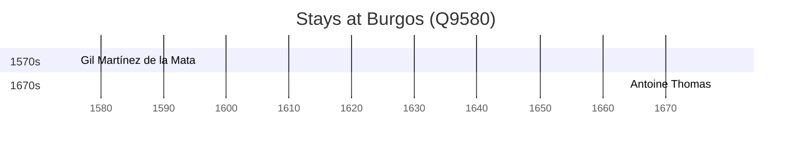

# Burgos (Q9580)

*municipality in Castile and Leon, Spain*

Wikidata: [Q9580](https://www.wikidata.org/wiki/Q9580)

2 occurrence(s) across 2 transcribed value(s), 2 person(s).

**Transcribed variants:**

- `towns` (1×, 1576–1576)
- `towns, Espanha` (1×, 1678–1678)

| Date | Variant | Person | Type | Entity id | Real entity |
|------|---------|--------|------|-----------|-------------|
| 1576 | towns | Gil Martínez de la Mata | jesuita-ordenacao-padre | [deh-gil-martinez-de-la-mata](deh-gil-martinez-de-la-mata) | — |
| 1678-02-02 | towns, Espanha | Antoine Thomas | jesuita-votos-local | [deh-antoine-thomas](deh-antoine-thomas) | [rp486350](rp486350) |

