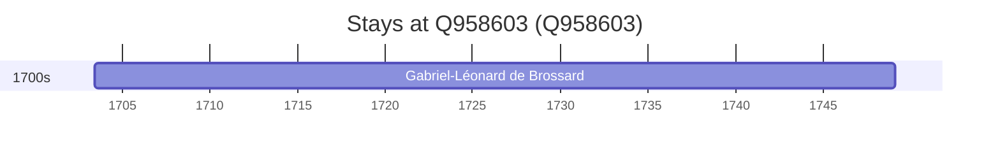

# Q958603

*(fetch error: HTTP Error 429: Too Many Requests)*

Wikidata: [Q958603](https://www.wikidata.org/wiki/Q958603)

1 occurrence(s) across 1 transcribed value(s), 1 person(s).

**Transcribed variants:**

- `Perche, diocese de Chartres` (1×, 1703–1703)

| Date | Variant | Person | Type | Entity id | Real entity |
|------|---------|--------|------|-----------|-------------|
| 1703-06-10 | Perche, diocese de Chartres | Gabriel-Léonard de Brossard | nascimento | [deh-gabriel-leonard-de-brossard](deh-gabriel-leonard-de-brossard) | [rp176128](rp176128) |

