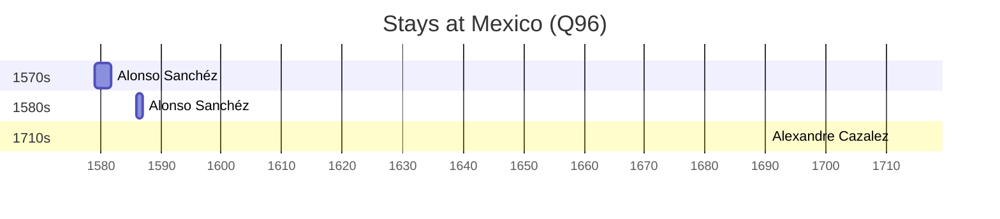

# Mexico (Q96)

*country in North America*

Wikidata: [Q96](https://www.wikidata.org/wiki/Q96)

7 occurrence(s) across 1 transcribed value(s), 6 person(s).

**Transcribed variants:**

- `México` (7×, 1538–1586)

| Date | Variant | Person | Type | Entity id | Real entity |
|------|---------|--------|------|-----------|-------------|
| — | México | Leandro Felipe | estadia | [deh-leandro-felipe](deh-leandro-felipe) | — |
| — | México | Gonzalo Velmonte | estadia | [deh-leandro-felipe-ref1](deh-leandro-felipe-ref1) | — |
| — | México | Louis Jean-Xavier Armand Nyel | estadia | [deh-louis-jean-xavier-armand-nyel](deh-louis-jean-xavier-armand-nyel) | — |
| 1538 | México | Cosmas Torres | partida | [deh-cosmas-torres](deh-cosmas-torres) | — |
| 1579 | México | Alonso Sanchéz | chegada | [deh-alonso-sanchez](deh-alonso-sanchez) | — |
| 1586 | México | Alonso Sanchéz | chegada | [deh-alonso-sanchez](deh-alonso-sanchez) | — |
| <1711-07 | México | Alexandre Cazalez | estadia | [deh-alexandre-cazalez](deh-alexandre-cazalez) | — |

