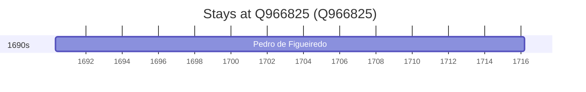

# Q966825

*(fetch error: HTTP Error 429: Too Many Requests)*

Wikidata: [Q966825](https://www.wikidata.org/wiki/Q966825)

1 occurrence(s) across 1 transcribed value(s), 1 person(s).

**Transcribed variants:**

- `Pombal` (1×, 1690–1690)

| Date | Variant | Person | Type | Entity id | Real entity |
|------|---------|--------|------|-----------|-------------|
| 1690-04-29 | Pombal | Pedro de Figueiredo | nascimento | [deh-pedro-de-figueiredo-ii](deh-pedro-de-figueiredo-ii) | — |

