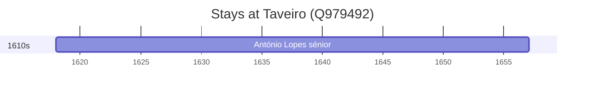

# Taveiro (Q979492)

*former civil parish in Portugal*

Wikidata: [Q979492](https://www.wikidata.org/wiki/Q979492)

1 occurrence(s) across 1 transcribed value(s), 1 person(s).

**Transcribed variants:**

- `Taveiro, diocese de Coimbra` (1×, 1618–1618)

| Date | Variant | Person | Type | Entity id | Real entity |
|------|---------|--------|------|-----------|-------------|
| 1618 | Taveiro, diocese de Coimbra | António Lopes, sénior | nascimento | [deh-antonio-lopes-senior](deh-antonio-lopes-senior) | — |

