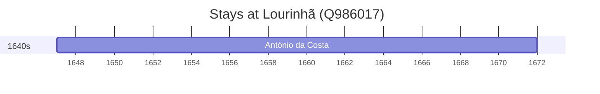

# Lourinhã (Q986017)

*municipality of Portugal*

Wikidata: [Q986017](https://www.wikidata.org/wiki/Q986017)

1 occurrence(s) across 1 transcribed value(s), 1 person(s).

**Transcribed variants:**

- `Lourinhã` (1×, 1647–1647)

| Date | Variant | Person | Type | Entity id | Real entity |
|------|---------|--------|------|-----------|-------------|
| 1647 | Lourinhã | António da Costa | nascimento | [deh-antonio-da-costa-ii](deh-antonio-da-costa-ii) | — |

