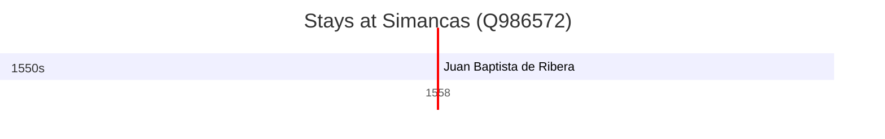

# Simancas (Q986572)

*municipality of Spain*

Wikidata: [Q986572](https://www.wikidata.org/wiki/Q986572)

1 occurrence(s) across 1 transcribed value(s), 1 person(s).

**Transcribed variants:**

- `Simacas` (1×, 1558–1558)

| Date | Variant | Person | Type | Entity id | Real entity |
|------|---------|--------|------|-----------|-------------|
| 1558-04-12 | Simacas | Juan Baptista de Ribera | jesuita-ordenacao-padre | [deh-juan-baptista-de-ribera](deh-juan-baptista-de-ribera) | — |

