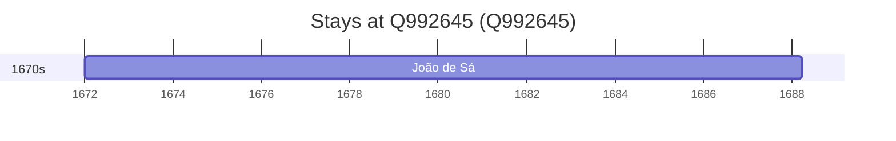

# Q992645

*(fetch error: HTTP Error 429: Too Many Requests)*

Wikidata: [Q992645](https://www.wikidata.org/wiki/Q992645)

1 occurrence(s) across 1 transcribed value(s), 1 person(s).

**Transcribed variants:**

- `Sabugal, diocese de Lamego` (1×, 1672–1672)

| Date | Variant | Person | Type | Entity id | Real entity |
|------|---------|--------|------|-----------|-------------|
| 1672 | Sabugal, diocese de Lamego | João de Sá | nascimento | [deh-joao-de-sa](deh-joao-de-sa) | — |

