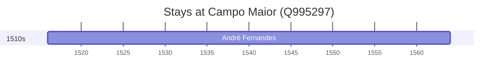

# Campo Maior (Q995297)

*municipality of Portugal*

Wikidata: [Q995297](https://www.wikidata.org/wiki/Q995297)

1 occurrence(s) across 1 transcribed value(s), 1 person(s).

**Transcribed variants:**

- `Campo Maior` (1×, 1516–1516)

| Date | Variant | Person | Type | Entity id | Real entity |
|------|---------|--------|------|-----------|-------------|
| 1516 | Campo Maior | André Fernandes | nascimento | [deh-andre-fernandes-i](deh-andre-fernandes-i) | — |

